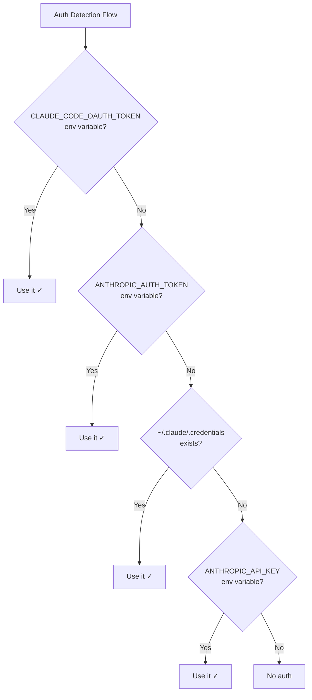

import { Aside, Steps } from '@astrojs/starlight/components';

Auth Passthrough is a RAPID feature that automatically detects and reuses your existing AI tool credentials. If you're already logged into Claude Code, RAPID will use that authentication—no additional setup required.

## The Problem

Traditional workflows require explicit API key configuration:

```bash
# Old way: Manual API key setup
export ANTHROPIC_API_KEY="sk-ant-..."

# Or in configuration files
{
  "secrets": {
    "items": {
      "ANTHROPIC_API_KEY": "op://Vault/Anthropic/key"
    }
  }
}
```

This creates friction:

- Users must obtain and manage API keys
- Keys must be securely stored and rotated
- Different environments need different configurations
- Running `rapid dev` prompts for authentication even when already logged in

## The Solution

RAPID's auth passthrough automatically detects existing credentials:

```bash
# Already logged into Claude Code?
claude --version  # ✓ Works

# RAPID detects and reuses your auth
rapid dev  # No prompts! Just works.
```

## How It Works

When you run `rapid dev`, RAPID checks for credentials in this order:

<Steps>

1. **Environment Variables** (explicit)
   - `CLAUDE_CODE_OAUTH_TOKEN` - Official Claude Code OAuth token
   - `ANTHROPIC_AUTH_TOKEN` - Anthropic auth token
   - `ANTHROPIC_API_KEY` - Direct API key

2. **Credential Files**
   - `~/.claude/.credentials.json` - Claude Code credentials (Linux/Windows)
   - `~/.claude.json` - Legacy OAuth account info

3. **System Keychain** (macOS)
   - Claude Code stores tokens in the macOS Keychain
   - Use `claude setup-token` to export for container use

</Steps>

## Detection Flow



## Credential Types

### OAuth Tokens (Preferred)

OAuth tokens are the preferred authentication method:

- **Automatic refresh**: Tokens refresh automatically
- **No key management**: No API keys to rotate
- **Account-based**: Uses your Anthropic account

Claude Code uses OAuth by default when you run `claude` and log in.

### API Keys (Fallback)

Direct API keys work but have limitations:

- **Manual management**: You must obtain and secure the key
- **No refresh**: Keys don't auto-refresh
- **Billing**: Direct billing to your account

## Platform-Specific Behavior

### macOS

Claude Code stores OAuth tokens in the macOS Keychain:

```bash
# Tokens are in Keychain (not directly accessible)
# Use setup-token to create a portable token
claude setup-token

# This sets CLAUDE_CODE_OAUTH_TOKEN in your shell
```

<Aside type="tip">
  Run `claude setup-token` once, then add the export to your shell profile for persistent access.
</Aside>

### Linux/Windows

Credentials are stored in `~/.claude/.credentials.json`:

```json
{
  "accessToken": "...",
  "refreshToken": "...",
  "expiresAt": "..."
}
```

RAPID reads this file directly—no additional setup needed.

## Container Environments

When running in containers (devcontainers, Docker), RAPID passes credentials through environment variables:

```bash
# RAPID automatically sets these in the container
ANTHROPIC_AUTH_TOKEN=<your-token>
CLAUDE_CODE_OAUTH_TOKEN=<your-token>
```

This means:

- No credential files needed in the container
- Credentials aren't written to disk
- Tokens are passed at runtime

## Checking Auth Status

Use `rapid auth` to see detected credentials:

```bash
rapid auth
```

Output:

```
Authentication Status
─────────────────────

Claude Code:
  ✓ Detected: OAuth token
  Source: CLAUDE_CODE_OAUTH_TOKEN
  Account: user@example.com

OpenAI:
  ✗ Not detected

Gemini:
  ✗ Not detected
```

## Troubleshooting

### "No authentication detected"

If RAPID can't find credentials:

1. **Check Claude Code login**:

   ```bash
   claude --version  # Should work without prompts
   ```

2. **Generate portable token** (macOS):

   ```bash
   claude setup-token
   # Follow prompts to set CLAUDE_CODE_OAUTH_TOKEN
   ```

3. **Check environment variables**:

   ```bash
   env | grep -E "ANTHROPIC|CLAUDE"
   ```

4. **Fall back to API key**:
   ```bash
   export ANTHROPIC_API_KEY="sk-ant-..."
   ```

### Credentials not passed to container

Ensure you're using `rapid dev` (not running the container manually):

```bash
# Correct - RAPID handles auth
rapid dev

# Incorrect - Manual docker run won't have credentials
docker run -it my-container
```

### Token expired

OAuth tokens refresh automatically, but if issues persist:

```bash
# Re-login to Claude Code
claude logout
claude login

# Or regenerate portable token
claude setup-token
```

## Security Considerations

### Token Storage

- **macOS**: Tokens in Keychain (encrypted)
- **Linux/Windows**: Tokens in `~/.claude/` (file permissions)
- **Containers**: Tokens in environment (memory only)

### Best Practices

1. **Don't commit tokens**: Never add tokens to version control
2. **Use OAuth**: Prefer OAuth over API keys
3. **Container isolation**: Run agents in containers for blast radius reduction
4. **Rotate keys**: If using API keys, rotate regularly

### Environment Variable Priority

Explicit environment variables override detected credentials:

```bash
# This overrides any detected auth
export ANTHROPIC_API_KEY="sk-ant-different-key"
rapid dev  # Uses the explicit key
```

## Configuration

Auth passthrough is enabled by default. To disable and require explicit configuration:

```json title="rapid.json"
{
  "agents": {
    "available": {
      "claude": {
        "cli": "claude",
        "envVars": ["ANTHROPIC_API_KEY"]
      }
    }
  }
}
```

With `envVars` specified, RAPID won't use passthrough and will require the listed variables.

## Related

- [Secrets Management](/guides/secrets-management/) - Managing API keys with 1Password/Vault
- [Agent Configuration](/guides/agent-configuration/) - Configuring AI agents
- [CLI Reference: rapid auth](/guides/cli-reference/#rapid-auth) - Auth status command
