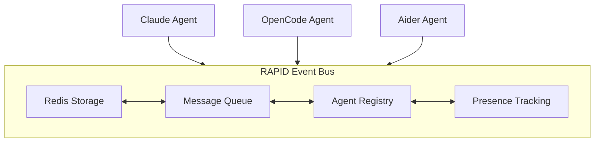

import { Aside } from '@astrojs/starlight/components';

The RAPID Event Bus enables multiple AI agents to communicate and coordinate their work in real-time. This is a foundational feature for advanced multi-agent workflows.

## Why an Event Bus?

Traditional AI coding assistants work in isolation. Each agent has its own context and cannot see what other agents are doing. This creates problems:

- **Duplication**: Two agents might work on the same problem
- **Conflicts**: Agents might make incompatible changes
- **Inefficiency**: No way to delegate tasks to specialized agents

The event bus solves these problems by providing a shared communication channel.

## Architecture



### Components

**Redis Storage**
: Persistent message storage using Redis. Messages are retained for the session lifetime, allowing agents to catch up on missed messages.

**Message Queue**
: FIFO queue for message delivery. Ensures messages are delivered in order and not lost.

**Agent Registry**
: Tracks which agents are connected and their capabilities. Enables targeted messaging.

**Presence Tracking**
: Monitors agent health and activity. Detects when agents disconnect.

## Message Flow

1. **Registration**: When an agent starts, it registers with the bus
2. **Publishing**: Agents publish messages to the bus
3. **Routing**: The bus routes messages to recipients (all or specific)
4. **Delivery**: Recipients receive messages via their MCP connection
5. **Acknowledgment**: Messages are marked as delivered

## Message Types

Messages have a `type` field that indicates their purpose:

### Task Messages

| Type            | Description                    |
| --------------- | ------------------------------ |
| `task_start`    | Agent beginning work on a task |
| `task_progress` | Progress update on a task      |
| `task_complete` | Task finished successfully     |
| `task_failed`   | Task failed with error         |
| `task_blocked`  | Task blocked, needs assistance |

### Collaboration Messages

| Type              | Description                            |
| ----------------- | -------------------------------------- |
| `review_request`  | Request code review from another agent |
| `review_complete` | Review finished with feedback          |
| `question`        | Ask a question to other agents         |
| `answer`          | Answer a question                      |
| `suggestion`      | Suggest an approach or solution        |

### Notification Messages

| Type           | Description        |
| -------------- | ------------------ |
| `file_changed` | File was modified  |
| `test_result`  | Test run completed |
| `build_result` | Build completed    |
| `error`        | Error occurred     |

## Addressing

Messages can be addressed in two ways:

### Broadcast

Send to all connected agents:

```json
{
  "type": "file_changed",
  "content": "Modified src/auth/login.ts"
}
```

### Direct

Send to a specific agent:

```json
{
  "type": "review_request",
  "to": "opencode",
  "content": "Please review the auth changes"
}
```

## Persistence

The event bus uses Redis for persistence:

- **Session Persistence**: Messages persist for the session lifetime
- **Reconnection**: Agents can retrieve missed messages after reconnection
- **History**: Full message history available via `rapid bus history`

<Aside type="tip">
  For long-running projects, configure `eventBus.redis.dataDir` to persist Redis data across
  restarts.
</Aside>

## Auto-Management

RAPID automatically manages the event bus:

1. **Auto-Start**: When you run `rapid dev`, the event bus starts automatically
2. **Docker Container**: Redis runs in a Docker container (`rapid-redis`)
3. **Health Monitoring**: RAPID monitors Redis health
4. **Cleanup**: Stopped when you run `rapid stop`

You never need to manually start or configure Redis.

## Integration with MCP

Agents interact with the event bus through MCP (Model Context Protocol) tools provided by the RAPID MCP server:

| Tool           | Description                 |
| -------------- | --------------------------- |
| `bus_register` | Register agent with the bus |
| `bus_send`     | Send a message              |
| `bus_messages` | Retrieve messages           |
| `bus_agents`   | List connected agents       |

See the [Multi-Agent Guide](/guides/multi-agent/) for usage examples.

## Configuration

Basic configuration (enabled by default):

```json title="rapid.json"
{
  "eventBus": {
    "enabled": true
  }
}
```

Advanced configuration:

```json title="rapid.json"
{
  "eventBus": {
    "enabled": true,
    "redis": {
      "port": 6379,
      "dataDir": "~/.rapid/redis-data"
    },
    "injection": {
      "enabled": true,
      "promptTemplate": "Connected agents: {{agents}}\nRecent activity: {{recent}}"
    },
    "autoCheck": {
      "enabled": true,
      "intervalMs": 30000
    }
  }
}
```

### Configuration Reference

| Option                     | Default  | Description                       |
| -------------------------- | -------- | --------------------------------- |
| `enabled`                  | `true`   | Enable the event bus              |
| `redis.port`               | `6379`   | Redis port number                 |
| `redis.dataDir`            | none     | Directory for Redis persistence   |
| `injection.enabled`        | `true`   | Inject agent context into prompts |
| `injection.promptTemplate` | built-in | Custom prompt template            |
| `autoCheck.enabled`        | `true`   | Auto-check for new messages       |
| `autoCheck.intervalMs`     | `30000`  | Check interval in milliseconds    |

## Use Cases

### Specialist Collaboration

Different agents have different strengths:

- **Claude**: Architecture, complex reasoning
- **Aider**: Quick edits, git operations
- **OpenCode**: Refactoring, code analysis

The event bus lets them work together:

```
Claude: "I've designed the auth module, delegating implementation to Aider"
  → sends task_start to Aider

Aider: Implements the module
  → sends task_complete with file list

Claude: "Please review the implementation, OpenCode"
  → sends review_request to OpenCode

OpenCode: Reviews and provides feedback
  → sends review_complete with suggestions
```

### Parallel Development

Multiple agents working on different features:

```
Claude: Working on feature A (src/features/a/)
Aider: Working on feature B (src/features/b/)

When Claude modifies shared types:
  → sends file_changed notification

Aider receives notification:
  → Updates imports in feature B
```

### Quality Assurance

One agent writes, another reviews:

```
Claude: Writes new code
  → sends review_request

OpenCode: Reviews code
  → sends review_complete with issues

Claude: Addresses issues
  → sends task_complete
```

## Limitations

- **Single Project**: The event bus is scoped to a single RAPID project
- **Local Only**: Agents must be on the same machine (for now)
- **Session Lifetime**: Messages are lost when Redis stops (unless persistence is configured)

## Related

- [Multi-Agent Guide](/guides/multi-agent/) - Practical guide to using multiple agents
- [RAPID MCP Server](/guides/mcp-servers/#rapid-mcp-server) - MCP tools reference
- [CLI Reference](/guides/cli-reference/#rapid-bus) - Event bus CLI commands
