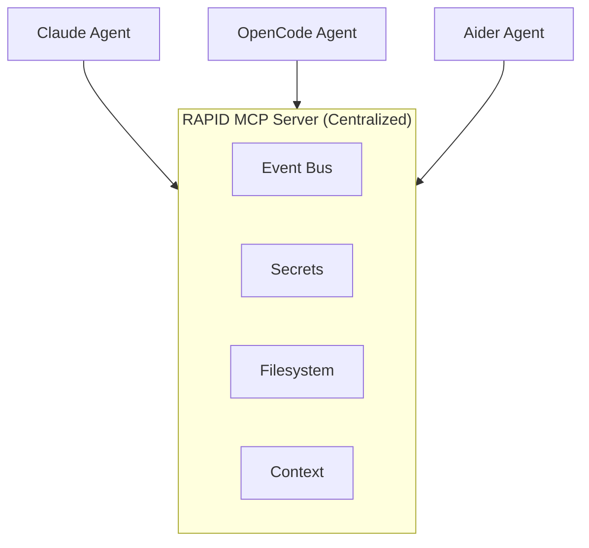

RAPID supports MCP (Model Context Protocol) servers to extend AI agent capabilities with external tools, data sources, and services.

## Overview

MCP servers provide AI agents with access to:

- **Documentation context** - Library and framework documentation
- **Web search** - Real-time information retrieval
- **Browser automation** - Web scraping and testing
- **Database access** - Query and manage databases
- **File system** - Read and write files
- **Memory** - Persistent knowledge graphs

## Quick Start

### Initialize with MCP Servers

When initializing a new RAPID project, you can specify which MCP servers to enable:

```bash
# Default setup (context7 + tavily)
rapid init

# Specify servers
rapid init --mcp context7,tavily,playwright

# Skip MCP configuration
rapid init --no-mcp
```

### Managing MCP Servers

Use the `rapid mcp` command to manage servers:

```bash
# List configured servers
rapid mcp list

# Show available templates
rapid mcp list --templates

# Add a server from template
rapid mcp add playwright

# Add a custom server
rapid mcp add myserver --type remote --url https://api.example.com/mcp

# Enable/disable servers
rapid mcp disable tavily
rapid mcp enable tavily

# Remove a server
rapid mcp remove playwright

# Show server status
rapid mcp status

# Regenerate config files
rapid mcp sync
```

## Available Server Templates

RAPID includes built-in templates for popular MCP servers:

| Server       | Type   | Description                         | Required Secrets   |
| ------------ | ------ | ----------------------------------- | ------------------ |
| `context7`   | Remote | Documentation context for libraries | `CONTEXT7_API_KEY` |
| `tavily`     | Remote | Web search and data extraction      | `TAVILY_API_KEY`   |
| `playwright` | Stdio  | Browser automation and web scraping | None               |
| `github`     | Stdio  | GitHub operations (PRs, issues)     | `GITHUB_TOKEN`     |
| `filesystem` | Stdio  | File system access                  | None               |
| `memory`     | Stdio  | Persistent knowledge graph          | None               |
| `postgres`   | Stdio  | PostgreSQL database access          | `DATABASE_URL`     |
| `slack`      | Stdio  | Slack messaging                     | `SLACK_TOKEN`      |
| `fetch`      | Stdio  | HTTP content retrieval              | None               |
| `sqlite`     | Stdio  | SQLite database access              | None               |

## RAPID MCP Server

RAPID includes a centralized MCP server that provides all agents with project-aware tools. This server runs as a **centralized service** (not per-agent) so that all agents share the same state—critical for features like the event bus.

The server uses the **Streamable HTTP transport** (the recommended MCP transport for server-based deployments), enabling efficient bidirectional communication with support for server-sent events (SSE).

### Architecture



The server runs in the RAPID daemon and all agents connect to it via HTTP.

### Tools Provided

| Tool             | Description                                 |
| ---------------- | ------------------------------------------- |
| `bus_register`   | Register agent with the event bus           |
| `bus_send`       | Send a message to other agents              |
| `bus_messages`   | Get messages from the event bus             |
| `bus_agents`     | List connected agents                       |
| `secure_exec`    | Execute commands in a sandboxed environment |
| `get_secret`     | Retrieve a secret by name                   |
| `list_secrets`   | List available secret names                 |
| `read_file`      | Read a file with path validation            |
| `write_file`     | Write a file with path validation           |
| `list_directory` | List directory contents                     |
| `fetch_url`      | Fetch content from a URL                    |

### Resources Provided

| Resource          | Description                         |
| ----------------- | ----------------------------------- |
| `rapid://config`  | Current rapid.json configuration    |
| `rapid://context` | Assembled project context           |
| `rapid://status`  | Project status (files, agents, bus) |

### Prompts Provided

| Prompt              | Description                         |
| ------------------- | ----------------------------------- |
| `rapid-methodology` | RAPID development methodology guide |

### Configuration

The RAPID MCP server is automatically configured to run centrally:

```json title="rapid.json"
{
  "mcp": {
    "servers": {
      "rapid": {
        "enabled": true,
        "type": "remote",
        "url": "http://localhost:${RAPID_MCP_PORT}/mcp"
      }
    }
  }
}
```

The server starts automatically when you run `rapid dev`. The port is managed by the RAPID daemon.

You can disable it (not recommended):

```json
{
  "mcp": {
    "servers": {
      "rapid": {
        "enabled": false
      }
    }
  }
}
```

### Why Centralized?

**Shared State**: All agents connect to the same server, enabling:

- Event bus messages visible to all agents
- Consistent secret access
- Coordinated file operations

**Efficiency**: One server process instead of N (one per agent).

**Coordination**: The server can mediate between agents, preventing conflicts.

### Using RAPID MCP Tools

Agents can use these tools directly:

```
Agent: "I'll check what other agents are working on"
→ Uses bus_agents tool

Agent: "Let me notify the team about the API changes"
→ Uses bus_send tool

Agent: "I need the database password"
→ Uses get_secret tool
```

See the [Multi-Agent Guide](/guides/multi-agent/) for detailed event bus usage.

## Configuration

### In rapid.json

MCP servers are configured in the `mcp` section:

```json
{
  "mcp": {
    "configFile": ".mcp.json",
    "servers": {
      "context7": {
        "enabled": true,
        "type": "remote",
        "url": "https://mcp.context7.com/mcp",
        "headers": {
          "Context7-API-Key": "${CONTEXT7_API_KEY}"
        }
      },
      "tavily": {
        "enabled": true,
        "type": "remote",
        "url": "https://mcp.tavily.com/mcp",
        "headers": {
          "Authorization": "Bearer ${TAVILY_API_KEY}"
        }
      },
      "playwright": {
        "enabled": true,
        "type": "stdio",
        "command": "npx",
        "args": ["@playwright/mcp@latest"]
      }
    }
  }
}
```

### Server Types

#### Remote (HTTP) Servers

Remote servers communicate over HTTP:

```json
{
  "myserver": {
    "type": "remote",
    "url": "https://api.example.com/mcp",
    "headers": {
      "Authorization": "Bearer ${API_KEY}"
    }
  }
}
```

#### Stdio Servers

Stdio servers run as local processes:

```json
{
  "myserver": {
    "type": "stdio",
    "command": "npx",
    "args": ["@example/mcp-server"],
    "env": {
      "API_KEY": "${API_KEY}"
    }
  }
}
```

### Variable Substitution

Server configurations support variable substitution:

| Syntax            | Description                         |
| ----------------- | ----------------------------------- |
| `${VAR}`          | Environment variable                |
| `${env:VAR}`      | Environment variable from container |
| `${localEnv:VAR}` | Environment variable from host      |

## Generated Config Files

RAPID generates two config files from your `rapid.json`:

### .mcp.json

Used by Claude Code and other MCP-compatible tools:

```json
{
  "mcpServers": {
    "context7": {
      "type": "http",
      "url": "https://mcp.context7.com/mcp",
      "headers": {
        "Context7-API-Key": "${CONTEXT7_API_KEY}"
      }
    }
  }
}
```

### opencode.json

Used by OpenCode with its specific format:

```json
{
  "$schema": "https://opencode.ai/config.json",
  "mcp": {
    "context7": {
      "type": "remote",
      "url": "https://mcp.context7.com/mcp",
      "headers": {
        "Context7-API-Key": "{env:CONTEXT7_API_KEY}"
      }
    }
  }
}
```

## Secrets for MCP Servers

Most MCP servers require API keys or tokens. Configure these in the `secrets.items` section:

```json
{
  "secrets": {
    "provider": "1password",
    "vault": "Development",
    "items": {
      "CONTEXT7_API_KEY": "op://Development/Context7/api-key",
      "TAVILY_API_KEY": "op://Development/Tavily/api-key",
      "GITHUB_TOKEN": "op://Development/GitHub/pat"
    }
  }
}
```

### Getting API Keys

| Server   | Where to Get Key                                                 |
| -------- | ---------------------------------------------------------------- |
| Context7 | [context7.com](https://context7.com)                             |
| Tavily   | [tavily.com](https://tavily.com)                                 |
| GitHub   | [github.com/settings/tokens](https://github.com/settings/tokens) |
| Slack    | [api.slack.com/apps](https://api.slack.com/apps)                 |

## Using MCP Servers

Once configured, MCP servers are automatically available to your AI agents during `rapid dev`:

1. RAPID loads secrets from your secret provider
2. Generates `.mcp.json` and `opencode.json` with resolved references
3. Sets `MCP_CONFIG_FILE` environment variable
4. Launches the agent with MCP servers available

### Example Workflow

```bash
# 1. Initialize project with MCP
rapid init --mcp context7,tavily

# 2. Add your API keys to secrets
# Edit rapid.json secrets.items

# 3. Verify secrets are accessible
rapid secrets verify

# 4. Start development with MCP servers
rapid dev
```

## Adding Custom MCP Servers

You can add any MCP-compatible server:

```bash
# Add a custom remote server
rapid mcp add myapi \
  --type remote \
  --url https://api.example.com/mcp \
  --header "Authorization=Bearer ${API_KEY}"

# Add a custom stdio server
rapid mcp add mytool \
  --type stdio \
  --command npx \
  --args "@example/mcp-server,--config,./config.json"
```

## Troubleshooting

### Server Not Appearing

If a server doesn't appear in agent tools:

1. Check it's enabled: `rapid mcp status`
2. Verify secrets: `rapid secrets verify`
3. Regenerate configs: `rapid mcp sync`

### Authentication Errors

If you get authentication errors:

1. Verify the API key is correct
2. Check the header format matches the server's requirements
3. Ensure secrets are loaded: `rapid secrets list`

### Stdio Server Fails to Start

If a stdio server won't start:

1. Check the command is installed: `which npx`
2. Verify the package exists
3. Check for error messages in agent output
