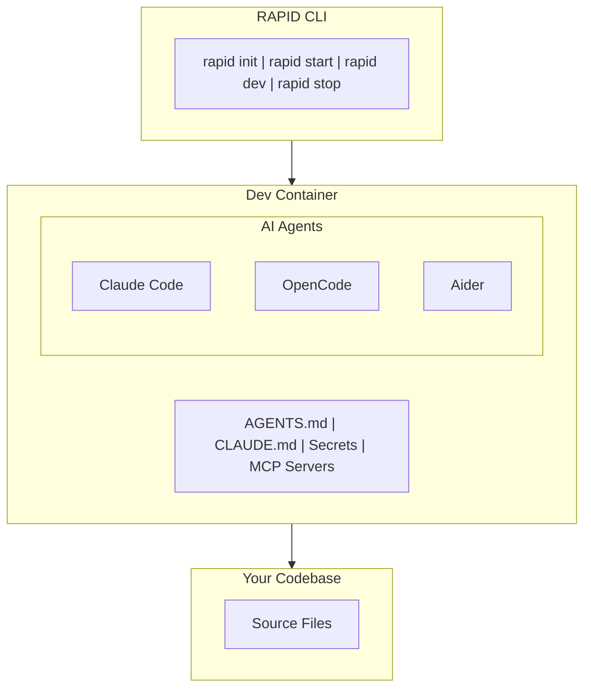

# RAPID Development Framework

> **R**esearch. **A**ugment. **P**lan. **I**ntegrate. **D**evelop.

RAPID orchestrates AI coding assistants within containerized development environments. It wraps tools like Claude Code, OpenCode, and Aider to provide a unified, secure, and reproducible developer experience.

## What RAPID Does

- **Manages dev container lifecycle** - `rapid start` / `rapid stop` handle everything
- **Auto-configures AI coding tools** - Installs and configures Claude, OpenCode, Aider inside containers
- **Handles secrets injection** - 1Password, Vault, or environment-based secret loading
- **Generates agent instruction files** - Creates AGENTS.md, CLAUDE.md with project context
- **Supports concurrent AI agents** - Run multiple agents in tmux-style panes

## Quick Start

```bash
npm install -g @rapid-dev/cli
rapid init
rapid start
rapid dev
```

## Commands

| Command | Description |
|---------|-------------|
| `rapid init` | Initialize RAPID in current project |
| `rapid start` | Start container, load secrets, prepare environment |
| `rapid dev` | Launch AI coding session |
| `rapid dev --multi` | Launch multiple agents concurrently |
| `rapid stop` | Stop container and cleanup |
| `rapid agent <name>` | Switch or add AI agent |
| `rapid config` | View/edit configuration |

## Supported AI Tools

| Tool | CLI | Status |
|------|-----|--------|
| Claude Code | `claude` | Supported |
| OpenCode | `opencode` | Supported |
| Aider | `aider` | Supported |
| Cursor | Editor mode | Planned |
| GitHub Copilot CLI | `gh copilot` | Planned |

## The RAPID Methodology

RAPID is both a tool and a methodology for effective AI-assisted development:

| Phase | Purpose |
|-------|---------|
| **Research** | Gather context before engaging AI - codebase structure, docs, patterns |
| **Augment** | Enhance with external knowledge - APIs, documentation, MCP servers |
| **Plan** | Structure work before execution - task breakdown, acceptance criteria |
| **Integrate** | Ensure environment readiness - containers, secrets, tooling |
| **Develop** | Execute with AI assistance - generate, test, iterate, review |

## Configuration

RAPID uses `rapid.json` for project configuration:

```json
{
  "version": "1.0",
  "agents": {
    "default": "claude",
    "available": {
      "claude": {
        "cli": "claude",
        "instructionFile": "CLAUDE.md"
      }
    }
  },
  "secrets": {
    "provider": "1password",
    "vault": "Development"
  }
}
```

## Documentation

### Concepts
- [RAPID Overview](./concepts/rapid-overview.md) - How RAPID works
- [Agent Integration](./concepts/agent-integration.md) - AI tool integration model
- [Container Lifecycle](./concepts/container-lifecycle.md) - Container management

### Guides
- [Quickstart](./guides/quickstart.md) - Get running in 5 minutes
- [CLI Reference](./guides/cli-reference.md) - Command documentation
- [Agent Configuration](./guides/agent-configuration.md) - Setting up AI tools
- [Secrets Management](./guides/secrets-management.md) - 1Password/Vault setup
- [Agent Files](./guides/agent-files.md) - AGENTS.md generation

### Reference
- [rapid.json Specification](./reference/rapid.json-spec.md) - Configuration reference
- [Supported Agents](./reference/supported-agents.md) - Compatibility matrix
- [Dev Container Security](./devcontainers.md) - Security best practices

### Examples
- [Example rapid.json](./examples/rapid.json) - Complete configuration example

## Architecture



## Requirements

- Docker Desktop, Podman, or compatible container runtime
- Node.js 18+
- API key for your AI provider (Anthropic, OpenAI, etc.)

## License

MIT
