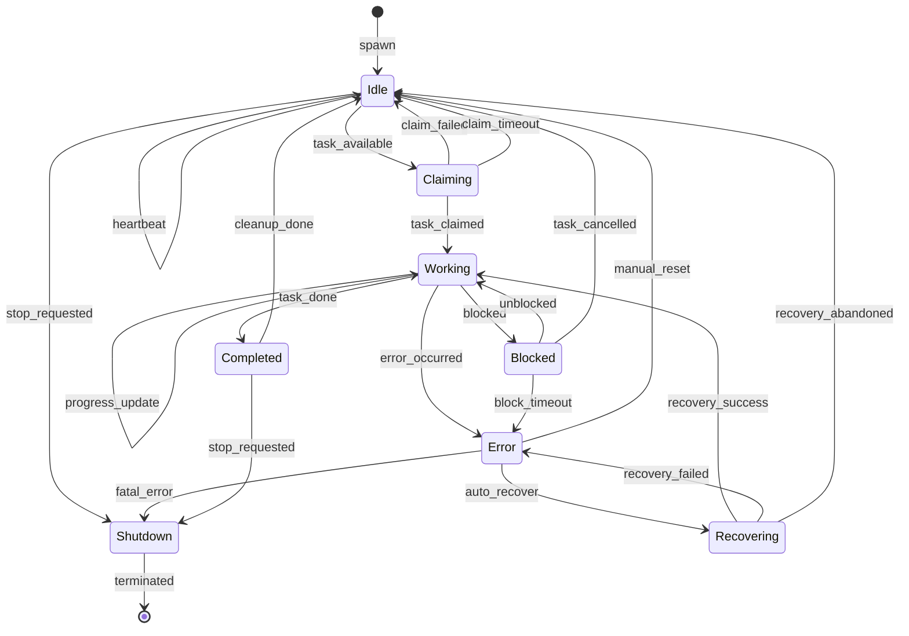

# Agent State Machine Architecture

This document describes the state machine architecture for RAPID worker agents, providing predictable behavior, reliable error recovery, and clear lifecycle management.

## Overview

Worker agents in RAPID operate as finite state machines (FSMs) with well-defined states and transitions. This architecture provides:

- **Predictability**: Clear states and valid transitions
- **Reliability**: Structured error handling and recovery
- **Observability**: State-based monitoring and debugging
- **Coordination**: Clean handoffs between orchestrator and workers

## Recommended Library: XState

After evaluating available options, **XState v5** is recommended for implementing agent state machines:

| Library                  | Pros                                                            | Cons                        |
| ------------------------ | --------------------------------------------------------------- | --------------------------- |
| **XState**               | Full statechart support, TypeScript-first, actors, visual tools | Learning curve, bundle size |
| Robot                    | Lightweight, simple API                                         | Limited features, no actors |
| JavaScript-state-machine | Simple, small                                                   | No TypeScript, dated        |

XState provides:

- TypeScript inference with `setup()` function
- Actor model for spawning child processes
- Guards for conditional transitions
- Parallel and hierarchical states
- Built-in delays and timeouts
- Visual editor (Stately Studio)

## Worker Agent States



### State Descriptions

#### 1. Idle

**Purpose**: Agent is ready to accept work.

| Property         | Value                              |
| ---------------- | ---------------------------------- |
| Entry actions    | Clear task context, send heartbeat |
| Exit actions     | Stop heartbeat timer               |
| Self-transitions | `heartbeat` (every 30s)            |

**Context when entering**:

```typescript
{
  taskId: null,
  worktree: currentWorktree,
  lastHeartbeat: timestamp,
  capabilities: ['coding', 'testing', ...],
  stats: { tasksCompleted, errorCount, ... }
}
```

#### 2. Claiming

**Purpose**: Agent is attempting to claim a task.

| Property      | Value                                     |
| ------------- | ----------------------------------------- |
| Entry actions | Send claim request to orchestrator        |
| Timeout       | 10 seconds                                |
| Guards        | `canClaimTask` - check capabilities match |

**Events**:

- `task_claimed` → Working (with task context)
- `claim_failed` → Idle (task taken by another agent)
- `claim_timeout` → Idle (orchestrator unresponsive)

#### 3. Working

**Purpose**: Agent is actively executing a task.

| Property      | Value                              |
| ------------- | ---------------------------------- |
| Entry actions | Initialize task context, log start |
| Ongoing       | Progress updates every 60s         |
| Timeout       | Task-specific (default: 30min)     |

**Parallel sub-states**:

- `execution` - Running the actual task
- `monitoring` - Sending progress updates
- `watching` - Detecting interrupts/cancellations

**Context additions**:

```typescript
{
  taskId: string,
  taskStartedAt: timestamp,
  lastProgressUpdate: timestamp,
  checkpoint: { phase, progress, ... }
}
```

#### 4. Blocked

**Purpose**: Agent cannot proceed without external intervention.

| Property      | Value                                 |
| ------------- | ------------------------------------- |
| Entry actions | Notify orchestrator, log block reason |
| Timeout       | 5 minutes (configurable)              |

**Block reasons**:

- Waiting for human review
- Dependency on another task
- Resource contention
- External service unavailable

**Events**:

- `unblocked` → Working (continue task)
- `block_timeout` → Error
- `task_cancelled` → Idle

#### 5. Completed

**Purpose**: Task finished successfully.

| Property      | Value                           |
| ------------- | ------------------------------- |
| Entry actions | Report completion, update stats |
| Exit actions  | Clean up task context           |

**Actions on entry**:

1. Send completion message to event bus
2. Increment `tasksCompleted` counter
3. Update average completion time
4. Trigger cleanup routines

#### 6. Error

**Purpose**: Something went wrong during task execution.

| Property      | Value                          |
| ------------- | ------------------------------ |
| Entry actions | Log error, notify orchestrator |
| Exit actions  | Clear error state              |

**Error categories**:
| Category | Recovery | Action |
|----------|----------|--------|
| Transient | Auto | Retry with backoff |
| Task-specific | Manual | Return task to queue |
| Agent-level | Reset | Clear context, return to Idle |
| Fatal | Shutdown | Terminate agent |

**Context additions**:

```typescript
{
  error: {
    code: string,
    message: string,
    category: 'transient' | 'task' | 'agent' | 'fatal',
    retryCount: number,
    occurredAt: timestamp
  }
}
```

#### 7. Recovering

**Purpose**: Attempting automatic recovery from error.

| Property      | Value                    |
| ------------- | ------------------------ |
| Entry actions | Start recovery procedure |
| Timeout       | 2 minutes                |
| Max retries   | 3                        |

**Recovery strategies**:

1. **Retry with backoff**: 1s, 2s, 4s delays
2. **Checkpoint restore**: Resume from last known good state
3. **Context reset**: Clear and reinitialize
4. **Escalate**: Notify orchestrator for intervention

#### 8. Shutdown

**Purpose**: Agent is terminating.

| Property      | Value                                  |
| ------------- | -------------------------------------- |
| Entry actions | Deregister from bus, cleanup resources |
| Final action  | Exit process                           |

**Cleanup checklist**:

- [ ] Send final heartbeat (status: offline)
- [ ] Return uncompleted task to queue
- [ ] Close file handles and connections
- [ ] Write session summary to logs
- [ ] Deregister from event bus

## Event Types

```typescript
type WorkerEvent =
  // Task lifecycle
  | { type: 'task_available'; taskId: string; requirements: string[] }
  | { type: 'task_claimed'; task: Task }
  | { type: 'claim_failed'; reason: string }
  | { type: 'claim_timeout' }
  | { type: 'task_done'; result: TaskResult }
  | { type: 'task_cancelled'; reason: string }

  // Working state
  | { type: 'progress_update'; phase: string; percent: number }
  | { type: 'blocked'; reason: string; waitingFor?: string }
  | { type: 'unblocked' }

  // Error handling
  | { type: 'error_occurred'; error: ErrorInfo }
  | { type: 'auto_recover' }
  | { type: 'recovery_success' }
  | { type: 'recovery_failed'; attempts: number }
  | { type: 'recovery_abandoned' }
  | { type: 'manual_reset' }
  | { type: 'fatal_error'; error: ErrorInfo }

  // Lifecycle
  | { type: 'heartbeat' }
  | { type: 'stop_requested'; graceful: boolean }
  | { type: 'cleanup_done' }
  | { type: 'terminated' };
```

## Guards (Transition Conditions)

```typescript
const guards = {
  // Can only claim if capabilities match
  canClaimTask: ({ context, event }) => {
    const required = event.requirements || [];
    return required.every((cap) => context.capabilities.includes(cap));
  },

  // Allow auto-recovery only if under retry limit
  canAutoRecover: ({ context }) => {
    return context.error?.retryCount < 3;
  },

  // Check if error is recoverable
  isRecoverableError: ({ context }) => {
    return context.error?.category !== 'fatal';
  },

  // Prevent transitions during active work
  isNotWorking: ({ context }) => {
    return context.taskId === null;
  },

  // Check graceful shutdown is possible
  canShutdownGracefully: ({ context }) => {
    return context.taskId === null || context.checkpointAvailable;
  },
};
```

## Actions

### Entry/Exit Actions by State

```typescript
const actions = {
  // Idle state
  clearTaskContext: assign({
    taskId: null,
    taskStartedAt: null,
    checkpoint: null,
  }),

  sendHeartbeat: ({ context, self }) => {
    eventBus.send({
      type: 'heartbeat',
      agentId: context.agentId,
      state: self.getSnapshot().value,
      capabilities: context.capabilities,
    });
  },

  // Claiming state
  sendClaimRequest: ({ context, event }) => {
    eventBus.send({
      type: 'claim_task',
      agentId: context.agentId,
      taskId: event.taskId,
    });
  },

  // Working state
  initializeTaskContext: assign({
    taskId: ({ event }) => event.task.id,
    taskStartedAt: () => Date.now(),
    checkpoint: () => ({ phase: 'starting', progress: 0 }),
  }),

  saveCheckpoint: assign({
    checkpoint: ({ context, event }) => ({
      phase: event.phase,
      progress: event.percent,
      savedAt: Date.now(),
    }),
  }),

  // Error state
  logError: ({ context, event }) => {
    logger.error('Agent error', {
      agentId: context.agentId,
      taskId: context.taskId,
      error: event.error,
    });
  },

  notifyOrchestrator: ({ context, event }) => {
    eventBus.send({
      type: 'agent_error',
      agentId: context.agentId,
      taskId: context.taskId,
      error: event.error,
    });
  },

  // Completion
  reportCompletion: ({ context }) => {
    eventBus.send({
      type: 'completion',
      agentId: context.agentId,
      taskId: context.taskId,
      duration: Date.now() - context.taskStartedAt,
    });
  },

  updateStats: assign({
    stats: ({ context }) => ({
      ...context.stats,
      tasksCompleted: context.stats.tasksCompleted + 1,
    }),
  }),

  // Shutdown
  deregisterFromBus: ({ context }) => {
    eventBus.deregister(context.agentId);
  },

  returnTaskToQueue: ({ context }) => {
    if (context.taskId) {
      eventBus.send({
        type: 'task_returned',
        taskId: context.taskId,
        reason: 'agent_shutdown',
        checkpoint: context.checkpoint,
      });
    }
  },
};
```

## XState Implementation

```typescript
import { setup, assign, fromPromise } from 'xstate';

interface WorkerContext {
  agentId: string;
  worktree: string;
  capabilities: string[];
  taskId: string | null;
  taskStartedAt: number | null;
  checkpoint: { phase: string; progress: number } | null;
  error: {
    code: string;
    message: string;
    category: 'transient' | 'task' | 'agent' | 'fatal';
    retryCount: number;
  } | null;
  stats: {
    tasksCompleted: number;
    errorCount: number;
    avgCompletionTime: number;
  };
}

const workerMachine = setup({
  types: {
    context: {} as WorkerContext,
    events: {} as WorkerEvent,
  },
  actions: {
    clearTaskContext,
    sendHeartbeat,
    sendClaimRequest,
    initializeTaskContext,
    saveCheckpoint,
    logError,
    notifyOrchestrator,
    reportCompletion,
    updateStats,
    deregisterFromBus,
    returnTaskToQueue,
  },
  guards: {
    canClaimTask,
    canAutoRecover,
    isRecoverableError,
    isNotWorking,
    canShutdownGracefully,
  },
  delays: {
    CLAIM_TIMEOUT: 10_000,
    BLOCK_TIMEOUT: 300_000,
    RECOVERY_TIMEOUT: 120_000,
    HEARTBEAT_INTERVAL: 30_000,
  },
}).createMachine({
  id: 'worker',
  initial: 'idle',
  context: ({ input }) => ({
    agentId: input.agentId,
    worktree: input.worktree,
    capabilities: input.capabilities,
    taskId: null,
    taskStartedAt: null,
    checkpoint: null,
    error: null,
    stats: { tasksCompleted: 0, errorCount: 0, avgCompletionTime: 0 },
  }),

  states: {
    idle: {
      entry: ['clearTaskContext', 'sendHeartbeat'],
      after: {
        HEARTBEAT_INTERVAL: {
          target: 'idle',
          reenter: true,
        },
      },
      on: {
        task_available: {
          target: 'claiming',
          guard: 'canClaimTask',
        },
        stop_requested: 'shutdown',
      },
    },

    claiming: {
      entry: 'sendClaimRequest',
      after: {
        CLAIM_TIMEOUT: {
          target: 'idle',
          actions: () => console.log('Claim timed out'),
        },
      },
      on: {
        task_claimed: {
          target: 'working',
          actions: 'initializeTaskContext',
        },
        claim_failed: 'idle',
      },
    },

    working: {
      on: {
        progress_update: {
          actions: 'saveCheckpoint',
        },
        blocked: 'blocked',
        task_done: {
          target: 'completed',
          actions: ['reportCompletion', 'updateStats'],
        },
        error_occurred: 'error',
      },
    },

    blocked: {
      entry: 'notifyOrchestrator',
      after: {
        BLOCK_TIMEOUT: 'error',
      },
      on: {
        unblocked: 'working',
        task_cancelled: 'idle',
      },
    },

    completed: {
      on: {
        cleanup_done: 'idle',
        stop_requested: 'shutdown',
      },
    },

    error: {
      entry: ['logError', 'notifyOrchestrator'],
      on: {
        auto_recover: {
          target: 'recovering',
          guard: 'canAutoRecover',
        },
        manual_reset: 'idle',
        fatal_error: 'shutdown',
      },
    },

    recovering: {
      after: {
        RECOVERY_TIMEOUT: {
          target: 'error',
          actions: assign({
            error: ({ context }) => ({
              ...context.error!,
              retryCount: context.error!.retryCount + 1,
            }),
          }),
        },
      },
      on: {
        recovery_success: 'working',
        recovery_failed: 'error',
        recovery_abandoned: 'idle',
      },
    },

    shutdown: {
      entry: ['returnTaskToQueue', 'deregisterFromBus'],
      type: 'final',
    },
  },
});
```

## Timeout Handling

| State      | Timeout              | Action                            |
| ---------- | -------------------- | --------------------------------- |
| Idle       | None                 | Periodic heartbeat (30s)          |
| Claiming   | 10s                  | Return to Idle                    |
| Working    | 30min (configurable) | Transition to Error               |
| Blocked    | 5min                 | Transition to Error               |
| Recovering | 2min                 | Retry or give up                  |
| Error      | None                 | Wait for manual/auto intervention |

## Checkpointing & Resumption

Workers save checkpoints during long-running tasks:

```typescript
interface Checkpoint {
  taskId: string;
  phase: string;
  progress: number;
  savedAt: number;
  data: {
    completedSteps: string[];
    pendingSteps: string[];
    context: Record<string, unknown>;
  };
}
```

**Checkpoint triggers**:

1. Phase completion (e.g., "analysis done", "tests passing")
2. Periodic (every 5 minutes during active work)
3. Before blocking operations
4. On graceful shutdown

**Resumption flow**:

1. New worker claims abandoned task
2. Loads checkpoint from task metadata
3. Validates checkpoint is recent (< 1 hour)
4. Resumes from last completed phase

## Integration with Event Bus

The state machine integrates with RAPID's event bus for coordination:

```typescript
// Subscribe to events
eventBus.on('task_assigned', (event) => {
  if (event.assignedTo === agentId) {
    actor.send({ type: 'task_available', taskId: event.taskId });
  }
});

eventBus.on('stop_agent', (event) => {
  if (event.agentId === agentId) {
    actor.send({ type: 'stop_requested', graceful: event.graceful });
  }
});

// Emit state changes
actor.subscribe((state) => {
  eventBus.send({
    type: 'agent_state_changed',
    agentId,
    previousState: state.history?.value,
    currentState: state.value,
    context: {
      taskId: state.context.taskId,
      checkpoint: state.context.checkpoint,
    },
  });
});
```

## Benefits for RAPID

1. **Task Timeout Handling**: Clear timeout transitions prevent hung agents
2. **Error Recovery**: Structured retry logic with exponential backoff
3. **Context Clearing**: Clean slate between tasks prevents state leakage
4. **Checkpointing**: Resume interrupted work without starting over
5. **Observability**: State-based monitoring and alerting
6. **Testing**: Deterministic state transitions are easy to test

## Future Enhancements

- **Hierarchical states**: Sub-states for complex working phases
- **Parallel regions**: Concurrent monitoring and execution
- **History states**: Remember sub-state on re-entry
- **Spawned actors**: Child processes for sub-tasks
- **Visual debugging**: Integration with Stately Studio

## References

- [XState Documentation](https://stately.ai/docs)
- [LangGraph StateGraph](https://langchain-ai.github.io/langgraph/)
- [Actor Model](https://en.wikipedia.org/wiki/Actor_model)
- [Statecharts](https://statecharts.dev/)
