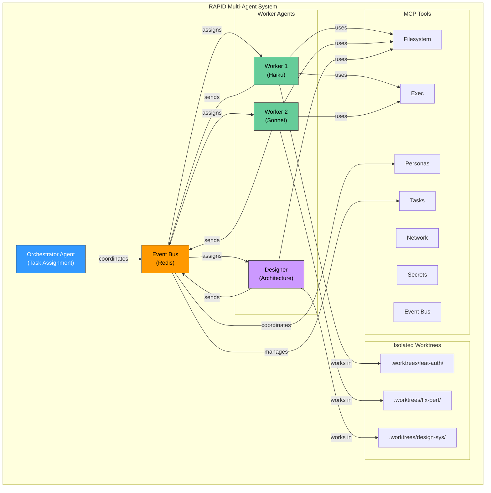
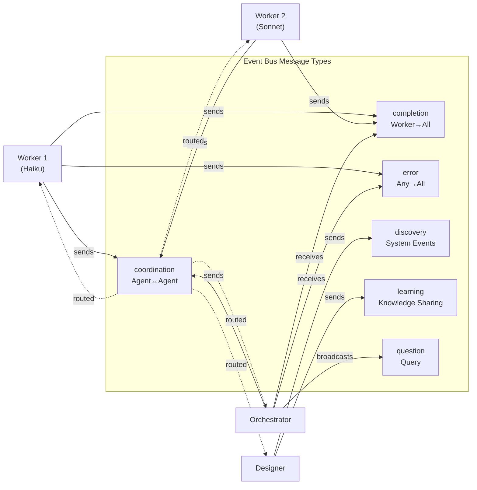
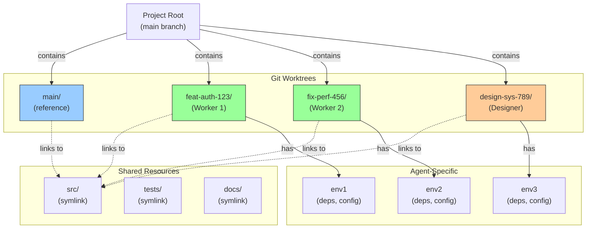
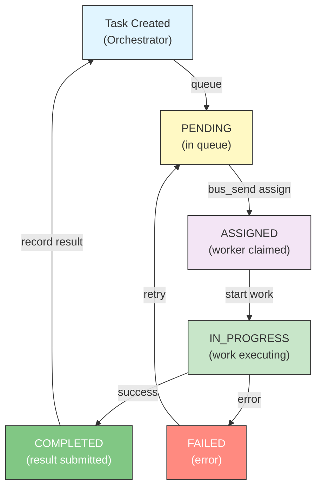
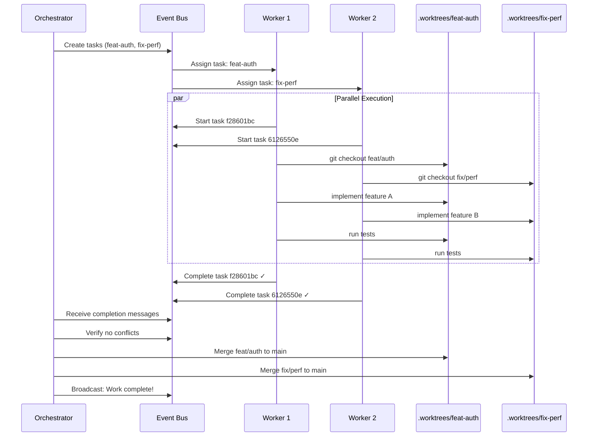
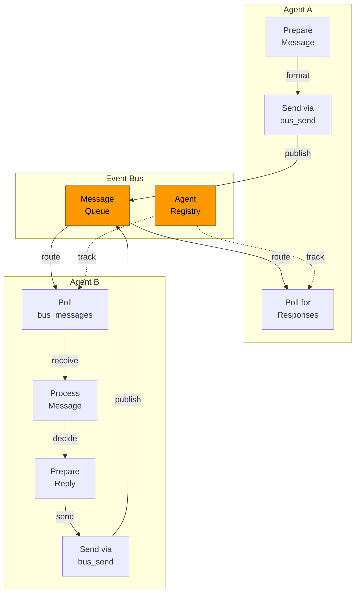
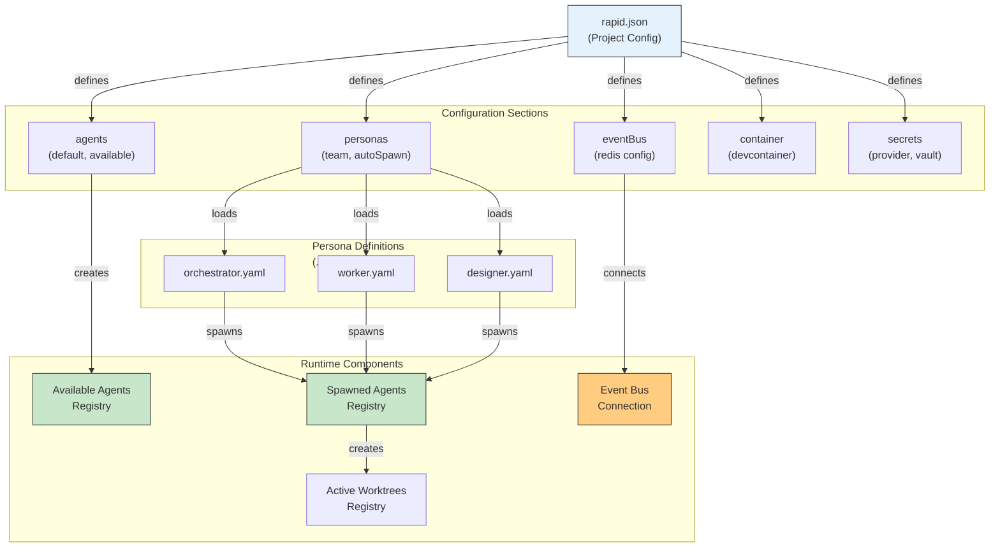
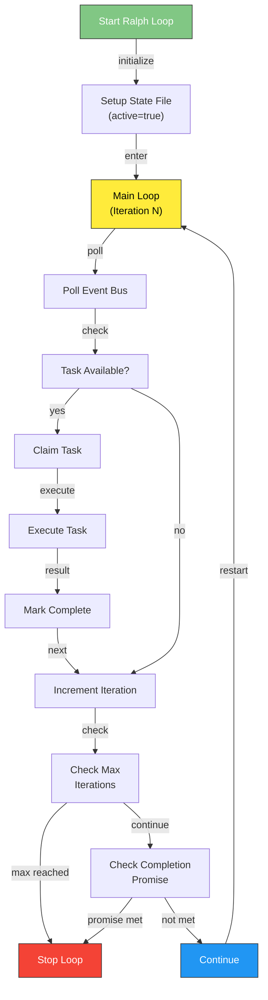

# RAPID Architecture Diagrams

Visual representations of the RAPID multi-agent system components and workflows.

## System Architecture Diagram

## Event Bus Communication

## Worktree Isolation Model

## Task Lifecycle

## Data Flow: Parallel Development

## Agent Communication Pattern

## Configuration Hierarchy

## Ralph-Loop Execution

## Deployment Workflow

```mermaid
graph LR
    rapid_init["rapid init<br/>(Setup Project)"]
    config["rapid.json<br/>+ .rapid/personas/"]
    rapid_start["rapid start<br/>(Launch System)"]

    subgraph "System Startup"
        check_docker["Check Docker"]
        build_container["Build Container"]
        start_bus["Start Event Bus"]
        spawn_team["Spawn Team Agents"]
    end

    rapid_dev["rapid dev<br/>(Enter Environment)"]

    subgraph "Development"
        agents_work["Agents Process<br/>Tasks Continuously"]
    end

    rapid_stop["rapid stop<br/>(Shutdown)"]

    rapid_init -->|create| config
    config -->|use| rapid_start
    rapid_start -->|verify| check_docker
    check_docker -->|build| build_container
    build_container -->|launch| start_bus
    start_bus -->|load personas| spawn_team
    spawn_team -->|ready| rapid_dev
    rapid_dev -->|enter| agents_work
    agents_work -->|poll| agents_work
    agents_work -->|stop| rapid_stop

    style rapid_init fill:#4caf50,stroke:#333,color:#fff
    style rapid_start fill:#2196f3,stroke:#333,color:#fff
    style rapid_dev fill:#ff9800,stroke:#333,color:#fff
    style agents_work fill:#9c27b0,stroke:#333,color:#fff
    style rapid_stop fill:#f44336,stroke:#333,color:#fff
```

## System Statistics

| Metric                            | Current                     | Target         |
| --------------------------------- | --------------------------- | -------------- |
| Active Agents                     | 2-3                         | 10+            |
| Task Throughput                   | 15 tasks                    | 50+ tasks/hour |
| Event Bus Messages                | 50+                         | 1000+          |
| Worktree Support                  | 3 active                    | 20+ concurrent |
| Agent Types                       | 3 (Haiku, Sonnet, Designer) | 6+ specialized |
| MCP Tools                         | 30+                         | 50+            |
| Response Time (task → completion) | < 5 min                     | < 2 min        |
| System Uptime                     | N/A                         | 99.9%          |

## Key Features

✅ **Orchestration** - Intelligent task assignment and coordination
✅ **Isolation** - Git worktrees prevent conflicts
✅ **Communication** - Real-time event bus messaging
✅ **Scaling** - Add agents dynamically
✅ **Automation** - Minimal human intervention
✅ **Transparency** - Complete audit trail
✅ **Resilience** - Fault tolerance and recovery
✅ **Integration** - Connects to GitHub, GitLab, Linear, Slack, etc.
