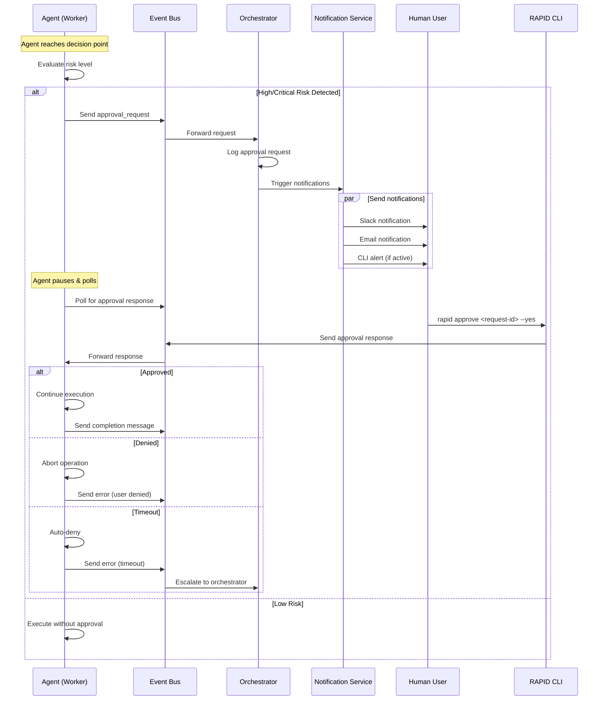
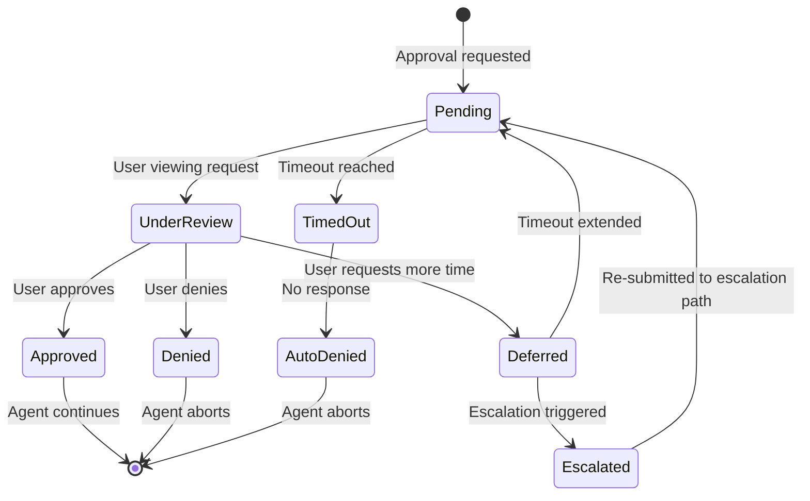
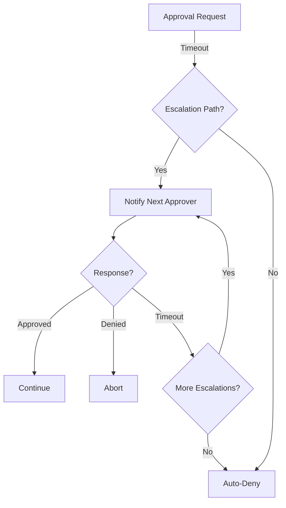

# Human-in-the-Loop (HITL) Approval Workflow

## Overview

The HITL approval workflow enables agents to pause execution and request human approval before taking actions with irreversible effects or high-risk consequences. This pattern ensures human oversight for critical decisions while maintaining agent autonomy for routine operations.

## Use Cases

**When to Request Approval:**

- Financial transactions or billing changes
- Production deployments
- Data deletion or destructive operations
- Sensitive API calls (e.g., sending emails, posting to social media)
- Security-related changes (permissions, access control)
- Infrastructure modifications (database schema changes, service configs)

## Architecture Diagram



## Approval Message Schema

### Approval Request Message

```typescript
interface ApprovalRequest {
  // Message metadata
  type: 'approval_request';
  messageId: string; // UUID for tracking
  timestamp: string; // ISO 8601

  // Agent context
  agentId: string; // Requesting agent ID
  agentName: string; // Human-readable agent name
  worktree?: string; // Git worktree/branch

  // Action details
  action: {
    type: string; // "deploy", "delete", "modify", "execute"
    target: string; // What's being acted upon
    summary: string; // Human-readable description
    details: object; // Full context for review
  };

  // Risk assessment
  riskLevel: 'low' | 'medium' | 'high' | 'critical';
  riskFactors: string[]; // Why this needs approval

  // Approval configuration
  timeout: number; // Auto-deny after N seconds (default: 300)
  requireReason: boolean; // User must provide reasoning
  escalationPath?: string[]; // Who to escalate to if timeout

  // Context for decision-making
  context: {
    files?: string[]; // Files affected
    commands?: string[]; // Commands to be executed
    diff?: string; // Code changes (if applicable)
    impact?: string; // Expected impact description
    rollback?: string; // Rollback procedure (if available)
  };
}
```

### Approval Response Message

```typescript
interface ApprovalResponse {
  type: 'approval_response';
  messageId: string; // Original request ID
  timestamp: string;

  // Response details
  decision: 'approved' | 'denied' | 'deferred';
  userId: string; // Who responded
  reason?: string; // Optional explanation

  // Conditional approval
  modifications?: {
    instructions: string; // Modified instructions for agent
    constraints: string[]; // Additional constraints to apply
  };

  // Escalation
  escalateTo?: string; // Escalate to another approver
}
```

## CLI Commands

### Primary Approval Command

```bash
# View pending approval requests
rapid approve list

# Approve a request
rapid approve <request-id> --yes
rapid approve <request-id> --approve
rapid approve abc123 -y

# Approve with reasoning
rapid approve abc123 --yes --reason "Deployment window open"

# Deny a request
rapid approve <request-id> --no
rapid approve <request-id> --deny
rapid approve abc123 -n --reason "Missing tests"

# Defer decision (extend timeout)
rapid approve <request-id> --defer
rapid approve <request-id> --defer --timeout 600

# Approve with modifications
rapid approve abc123 --yes --modify "Deploy to staging first"

# View request details
rapid approve show <request-id>
rapid approve show abc123 --json

# Bulk operations
rapid approve list --pending | xargs -I {} rapid approve {} --yes
rapid approve all --deny  # Deny all pending (requires confirmation)
```

### Configuration Commands

```bash
# Configure approval settings
rapid config set approval.autoApprove.riskLevel low
rapid config set approval.defaultTimeout 600
rapid config set approval.notifications.slack true
rapid config set approval.notifications.email user@example.com

# Set approval rules
rapid config set approval.rules.deploy "always"
rapid config set approval.rules.delete "always"
rapid config set approval.rules.modify "if-production"
```

## Approval Workflow States



## Risk Level Guidelines

### Low Risk (Auto-approve or fast-track)

- Reading files
- Running tests
- Non-destructive queries
- Documentation updates
- Linting and formatting

### Medium Risk (Standard approval, 5min timeout)

- Creating new features
- Updating dependencies
- Refactoring existing code
- Adding new API endpoints

### High Risk (Requires approval, 10min timeout)

- Deployment to staging
- Database migrations (reversible)
- Updating production configuration
- Modifying authentication logic

### Critical Risk (Requires approval + reasoning, 15min timeout)

- Deployment to production
- Irreversible database changes
- Deleting resources
- Financial transactions
- Security policy changes

## Timeout Behavior

### Default Timeouts by Risk Level

```yaml
timeouts:
  low: 60 # 1 minute
  medium: 300 # 5 minutes
  high: 600 # 10 minutes
  critical: 900 # 15 minutes
```

### Timeout Actions

1. **First timeout (50% elapsed)**
   - Send reminder notification
   - Display urgency indicator in CLI

2. **Second timeout (90% elapsed)**
   - Send urgent notification
   - Trigger escalation path if configured

3. **Final timeout (100% elapsed)**
   - Auto-deny request
   - Log denial reason: "timeout"
   - Send completion message to agent
   - Agent aborts operation

### Extending Timeouts

Users can extend timeouts for complex decisions:

```bash
rapid approve abc123 --defer --timeout 1800  # Add 30 more minutes
```

## Escalation Paths

### Configuration

```yaml
# In rapid.json
approval:
  escalationPaths:
    production-deploy:
      - 'tech-lead@example.com'
      - 'engineering-manager@example.com'
      - 'cto@example.com'
    financial-transaction:
      - 'finance-team@example.com'
      - 'cfo@example.com'
    security-change:
      - 'security-team@example.com'
      - 'ciso@example.com'
```

### Escalation Flow



## Audit Logging

All approval requests and responses are logged for compliance:

```typescript
interface ApprovalAuditLog {
  requestId: string;
  timestamp: string;
  agentId: string;
  action: object;
  riskLevel: string;
  decision: 'approved' | 'denied' | 'timeout';
  approver?: string;
  reason?: string;
  responseTime: number; // Milliseconds
  escalated: boolean;
}
```

### Storage

Audit logs are stored in:

- Event bus message history (Redis/in-memory)
- Local file: `.rapid/logs/approvals.jsonl`
- Remote logging service (if configured)

### Querying Audit Logs

```bash
# View all approval history
rapid logs approvals

# Filter by agent
rapid logs approvals --agent claude-worker-123

# Filter by decision
rapid logs approvals --decision denied

# Filter by date range
rapid logs approvals --since 2026-01-01 --until 2026-01-31

# Export to JSON
rapid logs approvals --json > approvals.json
```

## Notification Services

### Slack Integration

```yaml
# In rapid.json
approval:
  notifications:
    slack:
      enabled: true
      webhook: '${SLACK_WEBHOOK_URL}'
      channel: '#approvals'
      mentions:
        critical: '@tech-lead'
        high: '@channel'
```

**Slack Message Format:**

```
🚨 Approval Required (HIGH RISK)

Agent: claude-worker-abc123
Action: Deploy to production
Risk: High

📋 Details:
• Target: production environment
• Files: 23 changed
• Tests: ✅ All passing
• Branch: release/v2.1.0

⏱️ Timeout: 10 minutes

Approve: `/rapid approve req-xyz789 --yes`
Deny: `/rapid approve req-xyz789 --no`
Details: https://rapid.app/approvals/req-xyz789
```

### Email Integration

```yaml
approval:
  notifications:
    email:
      enabled: true
      smtp:
        host: '${SMTP_HOST}'
        port: 587
        from: 'rapid-approvals@example.com'
      recipients:
        - 'tech-lead@example.com'
      template: 'approval-request'
```

### CLI Integration

When RAPID CLI is active, approval requests appear in real-time:

```
┌─────────────────────────────────────────────┐
│  🚨 APPROVAL REQUIRED (HIGH RISK)          │
├─────────────────────────────────────────────┤
│  Request ID: req-xyz789                     │
│  Agent: claude-worker-abc123                │
│  Action: Deploy to production               │
│                                             │
│  Target: production environment             │
│  Risk: High                                 │
│  Timeout: 9:45 remaining                    │
│                                             │
│  [A] Approve  [D] Deny  [V] View Details   │
└─────────────────────────────────────────────┘
```

## Integration with Event Bus

### Agent Implementation

```typescript
// Agent requests approval
async function requestApproval(action: object, riskLevel: RiskLevel) {
  const requestId = generateUUID();

  await bus_send({
    type: 'approval_request',
    agentId: myAgentId,
    agentName: 'claude-worker',
    messageId: requestId,
    action,
    riskLevel,
    timeout: getTimeoutForRisk(riskLevel),
    context: {
      files: getAffectedFiles(),
      commands: getPlannedCommands(),
      diff: await getDiff(),
    },
  });

  // Poll for response
  const response = await pollForApproval(requestId, timeout);

  if (response.decision === 'approved') {
    return true;
  } else {
    throw new Error(`Approval denied: ${response.reason}`);
  }
}

// Agent polls for approval
async function pollForApproval(requestId: string, timeout: number) {
  const startTime = Date.now();

  while (Date.now() - startTime < timeout * 1000) {
    const messages = await bus_messages({
      types: ['approval_response'],
      filter: { messageId: requestId },
    });

    if (messages.length > 0) {
      return messages[0];
    }

    await sleep(2000); // Poll every 2 seconds
  }

  // Timeout reached
  return { decision: 'timeout' };
}
```

### CLI Implementation

```typescript
// CLI handles approval command
async function handleApprovalCommand(requestId: string, decision: Decision) {
  await bus_send({
    type: 'approval_response',
    messageId: requestId,
    decision,
    userId: getCurrentUser(),
    timestamp: new Date().toISOString(),
    reason: getOptionalReason(),
  });

  console.log(`✅ Approval ${decision} sent successfully`);
}
```

## Mobile Notifications

For on-the-go approvals:

### Push Notifications (Future Enhancement)

```yaml
approval:
  notifications:
    mobile:
      enabled: true
      service: 'pushover' # or "onesignal", "firebase"
      apiKey: '${MOBILE_PUSH_API_KEY}'
      urgency:
        low: 'silent'
        medium: 'normal'
        high: 'high'
        critical: 'emergency'
```

### Mobile Web Interface

Access approval requests via mobile-optimized web interface:

```
https://rapid.app/m/approvals
```

## Security Considerations

1. **Authentication**
   - Approval responses must be authenticated
   - Use API tokens or OAuth for CLI/web approvals
   - Log all approval attempts (successful and failed)

2. **Authorization**
   - Define approval policies per user/role
   - Restrict approvals to authorized personnel
   - Support multi-signature approvals for critical actions

3. **Audit Trail**
   - Immutable audit logs
   - Cryptographic signatures on approval records
   - Compliance with SOC2, HIPAA, GDPR requirements

4. **Rate Limiting**
   - Prevent approval spam/DoS attacks
   - Limit approval requests per agent/time window
   - Alert on unusual approval patterns

## Example Workflows

### Production Deployment

```typescript
// Agent preparing to deploy
const deployAction = {
  type: 'deploy',
  target: 'production',
  summary: 'Deploy release v2.1.0 to production',
  details: {
    version: 'v2.1.0',
    branch: 'release/v2.1.0',
    commits: 47,
    tests: '✅ All passing (2,341 tests)',
    migrations: '2 database migrations',
    rollback: 'rapid deploy rollback v2.0.9',
  },
};

// Request approval
const approved = await requestApproval(deployAction, 'critical');

if (approved) {
  await executeDeployment();
} else {
  console.log('Deployment aborted by user');
}
```

### Database Migration

```typescript
const migrationAction = {
  type: 'modify',
  target: 'database schema',
  summary: 'Add user_preferences table',
  details: {
    migration: '20260120_add_user_preferences.sql',
    reversible: true,
    affectedTables: ['user_preferences'],
    estimatedDowntime: '< 1 second',
    rollback: 'rapid migrate rollback 20260120',
  },
};

const approved = await requestApproval(migrationAction, 'high');
```

## Configuration Reference

Complete `rapid.json` configuration for HITL:

```json
{
  "approval": {
    "enabled": true,
    "defaultTimeout": 300,
    "autoApprove": {
      "riskLevel": "low"
    },
    "rules": {
      "deploy": "always",
      "delete": "always",
      "modify": "if-production",
      "execute": "if-destructive"
    },
    "notifications": {
      "slack": {
        "enabled": true,
        "webhook": "${SLACK_WEBHOOK_URL}",
        "channel": "#approvals"
      },
      "email": {
        "enabled": true,
        "recipients": ["approvers@example.com"]
      },
      "cli": {
        "enabled": true,
        "realTimeAlerts": true
      }
    },
    "escalationPaths": {
      "production-deploy": ["tech-lead@example.com", "cto@example.com"],
      "security-change": ["security@example.com"]
    },
    "audit": {
      "enabled": true,
      "storage": "local",
      "retention": "1y"
    }
  }
}
```

## Benefits

✅ **Safety** - Prevents costly mistakes and irreversible actions
✅ **Transparency** - Complete audit trail of all critical decisions
✅ **Flexibility** - Configure approval rules per project/environment
✅ **Accountability** - Clear ownership of approval decisions
✅ **Efficiency** - Auto-approve low-risk actions, require human oversight for high-risk
✅ **Compliance** - Meets regulatory requirements for change management

## Future Enhancements

- [ ] Multi-signature approvals (require N of M approvers)
- [ ] Conditional auto-approval based on test results
- [ ] Integration with incident management systems
- [ ] Video recording of approval context (screen/terminal state)
- [ ] AI-powered risk assessment suggestions
- [ ] Approval analytics and reporting dashboard
- [ ] Role-based approval policies (RBAC integration)
- [ ] Scheduled approval windows (e.g., "deploy only during business hours")
