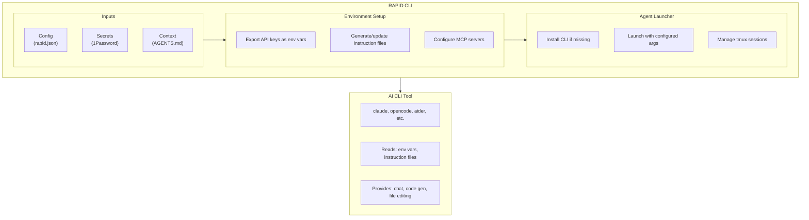
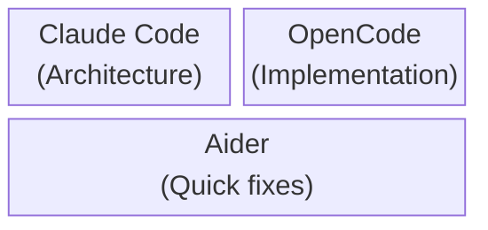

# Agent Integration

RAPID integrates with AI coding CLI tools by wrapping them rather than reimplementing them. This document explains how RAPID manages and orchestrates these tools.

## Supported Agents

| Agent          | CLI Command  | Instruction File | Provider         |
| -------------- | ------------ | ---------------- | ---------------- |
| Claude Code    | `claude`     | CLAUDE.md        | Anthropic        |
| OpenCode       | `opencode`   | AGENTS.md        | Multi-provider   |
| Aider          | `aider`      | .aider.conf.yml  | OpenAI/Anthropic |
| GitHub Copilot | `gh copilot` | -                | GitHub           |

## Integration Model



## How RAPID Wraps Agents

### 1. Environment Preparation

Before launching any agent, RAPID:

```bash
# Loads secrets and exports as environment variables
export ANTHROPIC_API_KEY="sk-ant-..."
export OPENAI_API_KEY="sk-..."

# Sets working directory
cd /workspaces/project

# Ensures instruction files exist
# (AGENTS.md, CLAUDE.md, etc.)
```

### 2. Agent Installation

If the CLI tool is missing, RAPID installs it:

```bash
# From rapid.json agents.available.<name>.installCmd
npm install -g @anthropic-ai/claude-code  # Claude
npm install -g opencode                     # OpenCode
pip install aider-chat                      # Aider
```

### 3. Agent Launch

RAPID executes the configured CLI:

```bash
# Single agent mode
claude

# With additional args (from rapid.json)
aider --model gpt-4o --auto-commits

# Multi-agent mode (tmux)
tmux new-session -d -s rapid
tmux send-keys -t rapid "claude" Enter
tmux split-window -h -t rapid
tmux send-keys -t rapid "aider" Enter
tmux attach -t rapid
```

## Instruction Files

Each agent reads project-specific instructions from designated files:

### CLAUDE.md

Used by Claude Code to understand project context:

```markdown
# Project: my-api

## Overview

Express.js REST API with PostgreSQL database.

## Code Style

- TypeScript with strict mode
- Async/await for all async operations
- Zod for validation

## Commands

- `npm run dev` - Start development server
- `npm test` - Run tests
- `npm run build` - Production build

## Architecture

src/
├── routes/ # API endpoints
├── services/ # Business logic
├── models/ # Database models
└── utils/ # Helpers
```

### AGENTS.md

Generic instruction file used by OpenCode and others:

```markdown
# Agent Instructions

## Project Type

TypeScript Node.js application

## Important Files

- src/index.ts - Entry point
- src/config.ts - Configuration
- package.json - Dependencies

## Testing

Always run `npm test` after changes.

## Restrictions

- Do not modify files in `dist/`
- Do not commit `.env` files
```

### .aider.conf.yml

Aider-specific configuration:

```yaml
model: gpt-4o
auto-commits: true
gitignore: true
map-tokens: 1024
```

## Multi-Agent Mode

RAPID supports running multiple agents concurrently using tmux:

```bash
rapid dev --multi
```

This creates a tmux session with panes for each configured agent:



### Tmux Controls

| Key                   | Action                 |
| --------------------- | ---------------------- |
| `Ctrl+b` then `o`     | Switch panes           |
| `Ctrl+b` then `arrow` | Navigate panes         |
| `Ctrl+b` then `z`     | Zoom current pane      |
| `Ctrl+b` then `d`     | Detach (keeps running) |

## Adding Custom Agents

Add new agents to `rapid.json`:

```json
{
  "agents": {
    "available": {
      "my-agent": {
        "cli": "my-ai-tool",
        "instructionFile": "MY_AGENT.md",
        "envVars": ["MY_API_KEY"],
        "installCmd": "npm install -g my-ai-tool",
        "args": ["--verbose", "--model", "custom"]
      }
    }
  }
}
```

## Agent Communication

Agents don't directly communicate with each other. Instead:

1. All agents share the same filesystem
2. Changes made by one agent are visible to others
3. Use git to track and review changes from any agent
4. Instruction files provide consistent context

## Best Practices

1. **Use specific agents for specific tasks**
   - Claude: Architecture, complex reasoning
   - Aider: Quick code changes, refactoring
   - OpenCode: Multi-model flexibility

2. **Keep instruction files updated**
   - Update when project structure changes
   - Add new patterns as they emerge

3. **Review multi-agent changes carefully**
   - Each agent may have different styles
   - Use git diff to review before committing

4. **Set appropriate context**
   - More context = better results
   - But too much context = slower responses
