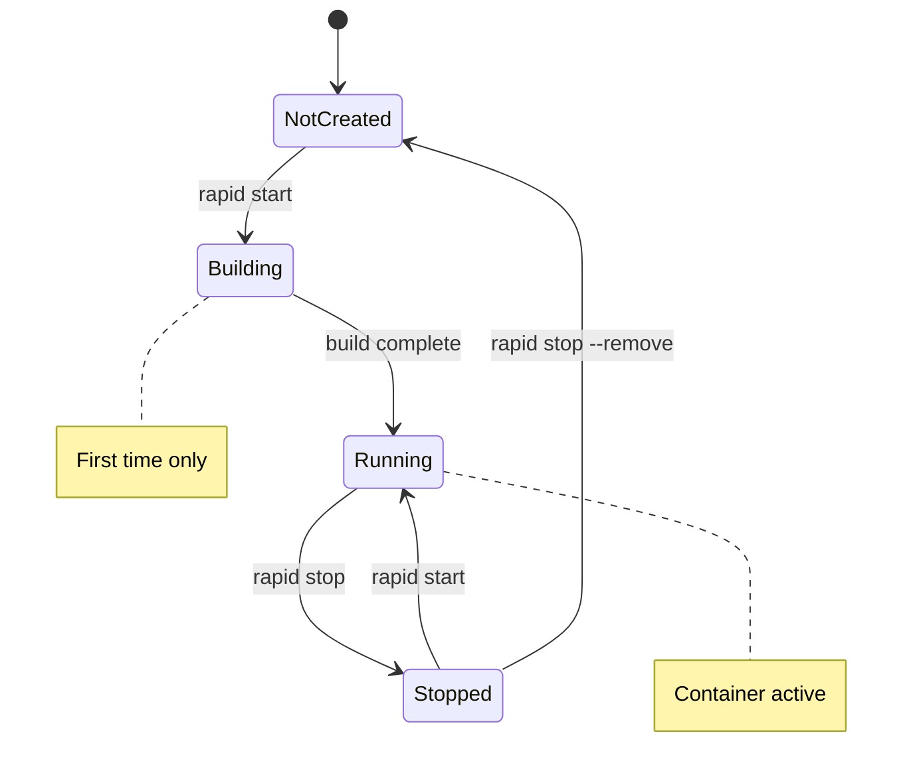
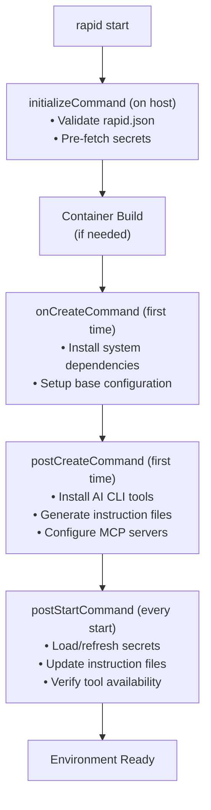

# Container Lifecycle

RAPID manages dev container lifecycle through simple commands. This document explains how containers are started, managed, and stopped.

## Overview



## Commands

### rapid start

Starts the development environment:

```bash
rapid start [options]
```

**Options:**

| Option              | Description                       |
| ------------------- | --------------------------------- |
| `--rebuild`         | Force rebuild the container image |
| `--no-cache`        | Build without Docker cache        |
| `--reinstall-tools` | Reinstall AI CLI tools            |
| `--skip-secrets`    | Skip secret loading               |

**What it does:**

1. **Reads configuration** - Parses `rapid.json` and `devcontainer.json`
2. **Builds container** - Runs `devcontainer build` if needed
3. **Starts container** - Runs `devcontainer up`
4. **Loads secrets** - Fetches from 1Password/Vault, exports as env vars
5. **Installs tools** - Installs missing AI CLI tools
6. **Generates files** - Creates/updates AGENTS.md, CLAUDE.md
7. **Configures MCP** - Sets up MCP servers if configured

### rapid dev

Launches an AI coding session:

```bash
rapid dev [options]
```

**Options:**

| Option           | Description                            |
| ---------------- | -------------------------------------- |
| `--agent <name>` | Use specific agent (overrides default) |
| `--multi`        | Launch all configured agents in tmux   |
| `--attach`       | Attach to existing session             |

**What it does:**

1. **Verifies container** - Starts if not running (when `autoStart: true`)
2. **Attaches to container** - Opens shell in container
3. **Launches agent** - Executes configured CLI command
4. **Manages session** - Creates tmux session for multi-agent

### rapid stop

Stops the development environment:

```bash
rapid stop [options]
```

**Options:**

| Option      | Description                     |
| ----------- | ------------------------------- |
| `--remove`  | Remove container after stopping |
| `--volumes` | Also remove volumes             |

**What it does:**

1. **Terminates agents** - Gracefully exits AI CLI sessions
2. **Stops container** - Runs `devcontainer stop`
3. **Cleans up** - Removes temporary files if configured

## Lifecycle Hooks

RAPID integrates with devcontainer lifecycle hooks:

```json
// devcontainer.json
{
  "initializeCommand": "rapid hooks initialize",
  "onCreateCommand": "rapid hooks onCreate",
  "postCreateCommand": "rapid hooks postCreate",
  "postStartCommand": "rapid hooks postStart"
}
```

### Hook Sequence



## Container Configuration

### From rapid.json

```json
{
  "container": {
    "devcontainer": ".devcontainer/devcontainer.json",
    "compose": null,
    "autoStart": true,
    "buildArgs": {
      "NODE_VERSION": "20"
    }
  }
}
```

### Relationship with devcontainer.json

RAPID uses but does not modify `devcontainer.json`. The relationship:

| Concern            | Configured In     |
| ------------------ | ----------------- |
| Base image         | devcontainer.json |
| System packages    | devcontainer.json |
| VS Code extensions | devcontainer.json |
| Port forwarding    | devcontainer.json |
| AI agents          | rapid.json        |
| Secrets            | rapid.json        |
| Context files      | rapid.json        |
| MCP servers        | rapid.json        |

## Docker Compose Support

For multi-container setups, specify a compose file:

```json
{
  "container": {
    "compose": "docker-compose.yml",
    "service": "app"
  }
}
```

RAPID will:

1. Start all services in the compose file
2. Attach to the specified service for AI sessions

## Volume Management

### Workspace Mount

By default, devcontainers mount the project directory:

```json
// devcontainer.json
{
  "workspaceMount": "source=${localWorkspaceFolder},target=/workspaces/${localWorkspaceFolderBasename},type=bind",
  "workspaceFolder": "/workspaces/${localWorkspaceFolderBasename}"
}
```

### Persistent Volumes

For data that should persist across rebuilds:

```json
// devcontainer.json
{
  "mounts": ["source=rapid-cache,target=/home/vscode/.cache,type=volume"]
}
```

## Troubleshooting

### Container won't start

```bash
# Check Docker is running
docker info

# View container logs
docker logs <container-id>

# Rebuild from scratch
rapid start --rebuild --no-cache
```

### Container slow on macOS

Enable VirtioFS in Docker Desktop settings for better file system performance.

### Permission issues

```bash
# Fix ownership (in container)
sudo chown -R vscode:vscode /workspaces
```

### Tools not found after restart

```bash
# Reinstall tools
rapid start --reinstall-tools
```

## Best Practices

1. **Use devcontainer features** for common tools
2. **Keep images small** - Install only what's needed
3. **Use volumes** for caches (npm, pip, etc.)
4. **Don't store secrets** in the container image
5. **Rebuild periodically** to get security updates
