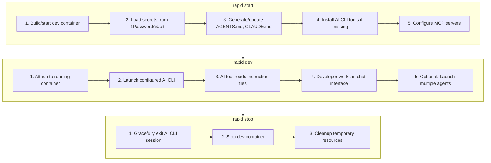

# RAPID Overview

RAPID is an orchestration layer for AI-assisted development. It manages the complexity of running AI coding tools inside containerized environments.

## The Problem

AI coding assistants are powerful but require significant setup:

1. **Environment Consistency** - AI tools need consistent environments to work reliably
2. **Context Preparation** - Agents perform better with proper documentation and project context
3. **Secret Management** - API keys must be injected securely, not committed to repos
4. **Container Isolation** - Running AI agents in containers provides security boundaries
5. **Tool Fragmentation** - Each AI tool (Claude, OpenCode, Aider) has different setup requirements

Setting this up for each project is tedious, error-prone, and often results in inconsistent experiences.

## The Solution

RAPID provides a single orchestration layer that:

## Core Principles

### 1. Wrap, Don't Reinvent

RAPID wraps existing AI coding tools rather than building another one. Claude Code, OpenCode, and Aider are excellent tools - RAPID makes them easier to use consistently.

### 2. Configuration as Code

Everything is defined in `rapid.json`:
- Which AI agents are available
- How secrets are loaded
- What context files to include
- Container configuration

### 3. Secure by Default

- Secrets never stored in plaintext
- Containers provide isolation
- API keys injected at runtime only

### 4. Multi-Agent Support

Run multiple AI tools concurrently in tmux-style panes. Use Claude for architecture questions while Aider handles implementation.

## The RAPID Methodology

Beyond tooling, RAPID embodies a methodology for effective AI-assisted development:

### Research (R)

Before engaging AI, gather context:
- Read existing documentation
- Understand codebase structure
- Identify patterns and conventions
- Review related implementations

**Why:** AI output quality correlates directly with context quality.

### Augment (A)

Enhance gathered context with external knowledge:
- API documentation
- Framework references
- Design patterns
- MCP server integrations

**Why:** Projects don't exist in isolation; external context improves AI understanding.

### Plan (P)

Structure work before execution:
- Break complex tasks into steps
- Define acceptance criteria
- Identify dependencies
- Create todo lists

**Why:** Prevents AI from going off-track; maintains focus.

### Integrate (I)

Ensure environment is ready:
- Start dev containers
- Load secrets
- Verify tooling
- Setup services

**Why:** A properly configured environment prevents mid-task failures.

### Develop (D)

Execute with AI assistance:
- Generate code
- Test implementations
- Iterate on feedback
- Review and refine

**Why:** This is where value is delivered.

## Comparison to Manual Setup

| Task | Manual | With RAPID |
|------|--------|------------|
| Start container | `devcontainer up`, wait, attach | `rapid start` |
| Load secrets | Export vars, source .env, etc. | Automatic |
| Install AI tools | npm install -g, pip install, etc. | Automatic |
| Generate context files | Write AGENTS.md manually | Auto-generated |
| Switch AI tools | Exit, configure, restart | `rapid agent <name>` |
| Run multiple agents | Manual tmux setup | `rapid dev --multi` |

## When to Use RAPID

**Good fit:**
- Teams wanting consistent AI-assisted workflows
- Projects requiring secure secret management
- Developers using multiple AI tools
- Organizations with container-based development

**Not necessary:**
- Single-file scripts or quick experiments
- Projects not using containers
- When using only one AI tool without secrets
