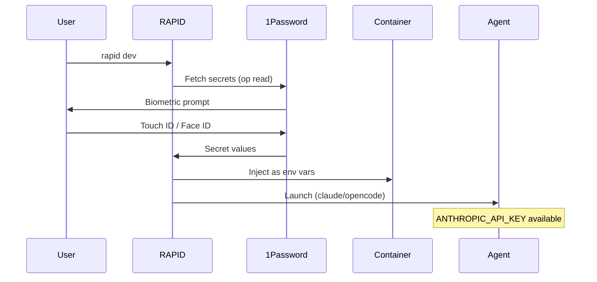
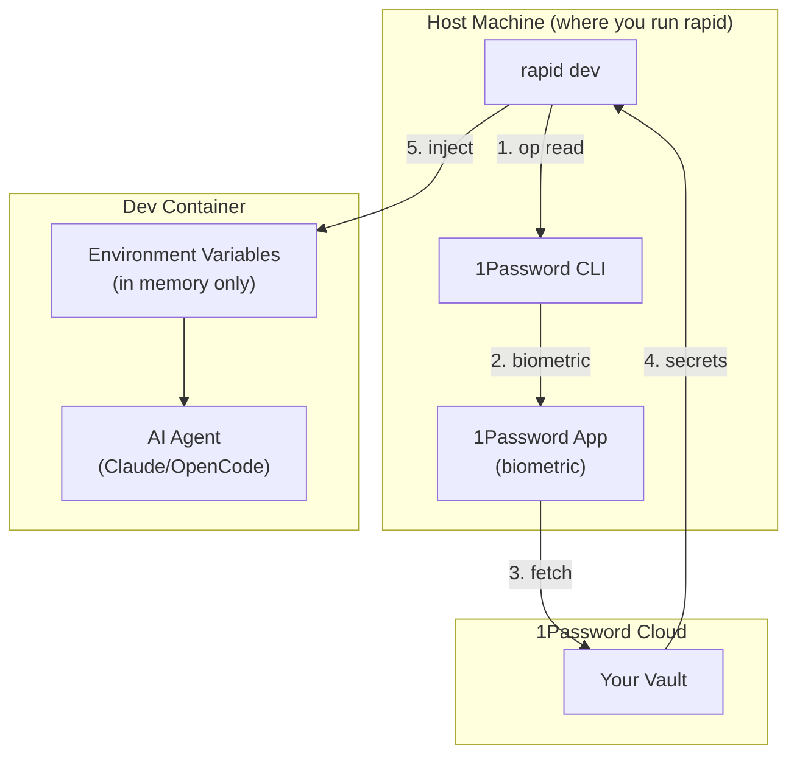
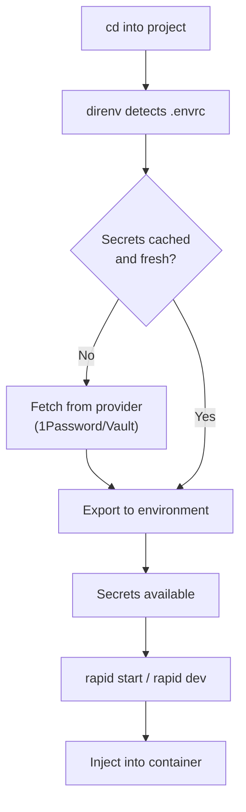
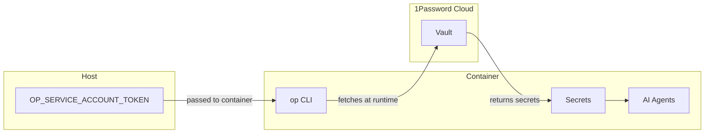
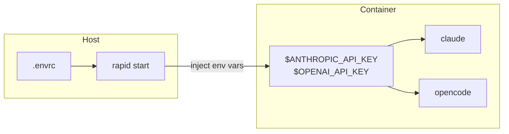

# Secrets Management

RAPID provides seamless, secure secrets management for AI-assisted development. When you run `rapid dev`, secrets are automatically fetched from 1Password and injected into your agent session - no manual configuration required.

## Philosophy

**Secure by default, invisible to use.**

- One command: `rapid dev` handles everything
- Secrets fetched just-in-time via biometric authentication (Touch ID, Face ID)
- Never stored in containers or on disk
- Audit trail in 1Password

## How It Works

When you run `rapid dev`:

1. RAPID reads your `rapid.json` secrets configuration
2. Fetches secrets from 1Password (prompts for biometric auth)
3. Injects them into the container session
4. Launches your AI agent with secrets available



## Architecture



## Quick Start

### 1. Install 1Password + CLI

```bash
# Install 1Password desktop app (required for biometric auth)
# Download from: https://1password.com/downloads

# Install CLI
brew install 1password-cli
```

Enable CLI integration in 1Password:

1. Open 1Password → Settings → Developer
2. Enable "Integrate with 1Password CLI"

### 2. Add Secrets to 1Password

Create items in a vault (e.g., "Development"):

- Item: "Anthropic" with field "api-key"
- Item: "OpenAI" with field "api-key"

### 3. Configure rapid.json

```json
{
  "secrets": {
    "provider": "1password",
    "vault": "Development",
    "items": {
      "ANTHROPIC_API_KEY": "op://Development/Anthropic/api-key",
      "OPENAI_API_KEY": "op://Development/OpenAI/api-key"
    }
  }
}
```

### 4. Run

```bash
rapid dev
```

That's it! RAPID will prompt for biometric auth and inject secrets automatically.

---

## Optional: direnv for Host Development

If you also want secrets available on your host machine (outside containers), use direnv:

### Install direnv

```bash
# macOS
brew install direnv

# Add to shell (zsh)
echo 'eval "$(direnv hook zsh)"' >> ~/.zshrc
```

### Generate .envrc

```bash
rapid secrets generate
direnv allow
```

Now secrets auto-load when you `cd` into the project.

---

## Alternative: Manual 1Password CLI

```bash
# macOS
brew install 1password-cli

# Sign in
eval $(op signin)
```

### 3. Create Project .envrc

```bash
# Run in your project directory
rapid init
```

This creates a `.envrc` file configured for your project:

```bash
# .envrc - RAPID project secrets
# This file is safe to commit - it contains NO secrets, only references

# Load secrets from 1Password
export ANTHROPIC_API_KEY=$(op read "op://Development/Anthropic/api-key")
export OPENAI_API_KEY=$(op read "op://Development/OpenAI/api-key")
export GITHUB_TOKEN=$(op read "op://Development/GitHub/pat")

# Optional: Load from .env.local for non-sensitive overrides
[[ -f .env.local ]] && source_env .env.local
```

### 4. Allow direnv

```bash
direnv allow
```

Now secrets automatically load when you `cd` into the project.

---

## Configuration in rapid.json

```json
{
  "secrets": {
    "provider": "1password",
    "vault": "Development",
    "items": {
      "ANTHROPIC_API_KEY": "op://Development/Anthropic/api-key",
      "OPENAI_API_KEY": "op://Development/OpenAI/api-key",
      "GITHUB_TOKEN": "op://Development/GitHub/pat"
    },
    "envrc": {
      "generate": true,
      "path": ".envrc"
    }
  }
}
```

When you run `rapid init` or `rapid secrets generate`, RAPID creates the `.envrc` from this config.

---

## Providers

### 1Password (Recommended)

Best for individuals and teams. Secrets stored in 1Password vaults, fetched via CLI.

#### Setup

1. Create a vault in 1Password (e.g., "Development")
2. Add items for each secret (API Credential type works well)
3. Reference in rapid.json using `op://` format

#### Secret Reference Format

```
op://vault-name/item-name/field-name
```

Examples:

- `op://Development/Anthropic/api-key`
- `op://Work/AWS/access-key-id`
- `op://Personal/GitHub/token`

#### Generated .envrc

```bash
# .envrc
export ANTHROPIC_API_KEY=$(op read "op://Development/Anthropic/api-key")
export OPENAI_API_KEY=$(op read "op://Development/OpenAI/api-key")
```

#### Authentication Methods

**Interactive (Local Development)**

```bash
# Sign in with biometric or password
eval $(op signin)
```

**Service Account (Dev Containers / CI)**

For non-interactive environments like dev containers, create a 1Password Service Account:

1. Go to [1Password Service Accounts](https://start.1password.com/developer-tools/infrastructure-secrets/serviceaccount/)
2. Create a new service account with access to your Development vault
3. Copy the service account token
4. Set the environment variable:

```bash
export OP_SERVICE_ACCOUNT_TOKEN="ops_..."
```

For dev containers, add to your `.devcontainer/devcontainer.json`:

```json
{
  "containerEnv": {
    "OP_SERVICE_ACCOUNT_TOKEN": "${localEnv:OP_SERVICE_ACCOUNT_TOKEN}"
  }
}
```

Then set `OP_SERVICE_ACCOUNT_TOKEN` in your shell profile (`.bashrc`, `.zshrc`) on the host machine.

> **Security Note:** Service account tokens should be treated like passwords. Never commit them to version control. Store them in your host machine's environment only.

### HashiCorp Vault

Best for enterprise and teams with existing Vault infrastructure.

#### Setup

```bash
export VAULT_ADDR="https://vault.example.com"
vault login
```

#### Configuration

```json
{
  "secrets": {
    "provider": "vault",
    "address": "https://vault.example.com",
    "path": "secret/data/myproject",
    "items": {
      "ANTHROPIC_API_KEY": "anthropic_key",
      "OPENAI_API_KEY": "openai_key"
    }
  }
}
```

#### Generated .envrc

```bash
# .envrc
export VAULT_ADDR="https://vault.example.com"
export ANTHROPIC_API_KEY=$(vault kv get -field=anthropic_key secret/data/myproject)
export OPENAI_API_KEY=$(vault kv get -field=openai_key secret/data/myproject)
```

---

## .env Files (Not Recommended)

**.env files are a security risk.** They store secrets in plaintext on disk, making them vulnerable to:

- Accidental git commits
- Malicious npm/pip packages reading filesystem
- Log file exposure
- Backup/sync service leaks

### If You Must Use .env Files

RAPID will detect and load `.env` files, but with warnings:

```json
{
  "secrets": {
    "provider": "env",
    "dotenv": {
      "enabled": true,
      "files": [".env", ".env.local"],
      "warn": true
    }
  }
}
```

### Safer Alternative: .env.local for Non-Secrets

Use `.env.local` for non-sensitive configuration only:

```bash
# .env.local (add to .gitignore)
# Non-sensitive overrides only!
LOG_LEVEL=debug
API_TIMEOUT=30000

# NEVER put secrets here:
# ANTHROPIC_API_KEY=sk-ant-...  # DON'T DO THIS
```

Reference in `.envrc`:

```bash
# .envrc
# Load secrets securely from 1Password
export ANTHROPIC_API_KEY=$(op read "op://Development/Anthropic/api-key")

# Load non-sensitive config from .env.local
[[ -f .env.local ]] && source_env .env.local
```

---

## Secret Loading Flow



---

## Commands

### rapid secrets generate

Generate `.envrc` from `rapid.json` configuration:

```bash
rapid secrets generate
```

Output:

```
Generated .envrc with 3 secrets
Run 'direnv allow' to activate
```

### rapid secrets verify

Verify all secrets are accessible:

```bash
rapid secrets verify
```

Output:

```
Verifying secrets...
  ✓ ANTHROPIC_API_KEY (1password)
  ✓ OPENAI_API_KEY (1password)
  ✓ GITHUB_TOKEN (1password)

All secrets verified.
```

### rapid secrets list

List configured secrets (names only, not values):

```bash
rapid secrets list
```

Output:

```
Configured secrets:
  ANTHROPIC_API_KEY  op://Development/Anthropic/api-key
  OPENAI_API_KEY     op://Development/OpenAI/api-key
  GITHUB_TOKEN       op://Development/GitHub/pat
```

---

## Security Best Practices

### Do

- Use 1Password or Vault for all secrets
- Commit `.envrc` to git (it contains no secrets, only references)
- Add `.env*` to `.gitignore`
- Use separate vaults for dev/staging/prod
- Rotate API keys periodically
- Audit secret access in your vault

### Don't

- Store secrets in `.env` files
- Commit any file containing actual secret values
- Share API keys between projects
- Use the same keys across environments
- Log or print secret values
- Store secrets in rapid.json

### Gitignore Template

```gitignore
# Secrets - NEVER commit these
.env
.env.local
.env.*.local
*.pem
*.key

# .envrc is safe to commit (contains only references)
# !.envrc
```

---

## Dev Container Integration

RAPID supports two approaches for secrets in dev containers:

### Option 1: Service Account Token (Recommended)

Use a 1Password Service Account for seamless secrets access inside the container.



**Setup:**

1. Create a 1Password Service Account with access to your Development vault
2. Set the token in your host environment:
   ```bash
   # Add to ~/.bashrc or ~/.zshrc
   export OP_SERVICE_ACCOUNT_TOKEN="ops_..."
   ```
3. Configure your devcontainer.json:
   ```json
   {
     "features": {
       "ghcr.io/devcontainers-extra/features/1password-cli:1": {}
     },
     "containerEnv": {
       "OP_SERVICE_ACCOUNT_TOKEN": "${localEnv:OP_SERVICE_ACCOUNT_TOKEN}"
     }
   }
   ```
4. Inside the container, use `rapid secrets verify` to confirm access

**Benefits:**

- Secrets fetched just-in-time, never stored in container
- Works with `op read` commands in scripts
- No interactive authentication needed
- Audit trail in 1Password

### Option 2: Environment Injection

Pass pre-resolved secrets to the container via environment variables.



**How It Works:**

```bash
# rapid start internally does something like:
source .envrc
devcontainer up --env ANTHROPIC_API_KEY="$ANTHROPIC_API_KEY" \
                --env OPENAI_API_KEY="$OPENAI_API_KEY"
```

Secrets are resolved on the host and passed as environment variables. They exist only in memory inside the container.

### Which to Choose?

| Approach              | Best For      | Pros                          | Cons                        |
| --------------------- | ------------- | ----------------------------- | --------------------------- |
| Service Account       | Teams, CI/CD  | Dynamic fetching, audit trail | Requires network access     |
| Environment Injection | Simple setups | Works offline                 | Secrets in container memory |

For most teams, **Service Account** is recommended as it provides better security and audit capabilities.

---

## Team Setup

### Shared Vault Approach

1. Create a shared 1Password vault: "Team-ProjectName"
2. Add team members to the vault
3. Everyone uses the same `.envrc`:

```bash
# .envrc (committed to repo)
export ANTHROPIC_API_KEY=$(op read "op://Team-ProjectName/Anthropic/api-key")
export OPENAI_API_KEY=$(op read "op://Team-ProjectName/OpenAI/api-key")
```

### Personal Overrides

Developers can override with personal credentials using `.envrc.local`:

```bash
# .envrc.local (gitignored)
export ANTHROPIC_API_KEY=$(op read "op://Personal/Anthropic/api-key")
```

Update `.envrc` to load it:

```bash
# .envrc
export ANTHROPIC_API_KEY=$(op read "op://Team-ProjectName/Anthropic/api-key")

# Allow personal overrides
[[ -f .envrc.local ]] && source_env .envrc.local
```

---

## Troubleshooting

### "direnv: error .envrc is blocked"

```bash
direnv allow
```

### "op: not signed in"

```bash
eval $(op signin)
```

### "op: item not found"

Verify the reference path:

```bash
op item get "Anthropic" --vault "Development"
```

### Secrets not in container

```bash
# Verify they're loaded on host
echo $ANTHROPIC_API_KEY

# Verify rapid sees them
rapid secrets verify

# Restart container
rapid stop && rapid start
```

### Slow secret loading

1Password caches credentials. If fetching is slow:

```bash
# Sign in again to refresh session
eval $(op signin)
```

---

## Migration from .env Files

If you have existing `.env` files:

### 1. Create secrets in 1Password

For each secret in `.env`:

1. Create an item in 1Password
2. Add the secret value

### 2. Update rapid.json

```json
{
  "secrets": {
    "provider": "1password",
    "vault": "Development",
    "items": {
      "ANTHROPIC_API_KEY": "op://Development/Anthropic/api-key"
    }
  }
}
```

### 3. Generate new .envrc

```bash
rapid secrets generate
direnv allow
```

### 4. Delete .env file

```bash
rm .env
```

### 5. Update .gitignore

Ensure `.env*` patterns are in `.gitignore`.

---

## Summary

| Method               | Security | Convenience | Recommended      |
| -------------------- | -------- | ----------- | ---------------- |
| `.envrc` + 1Password | High     | High        | Yes              |
| `.envrc` + Vault     | High     | Medium      | Yes (enterprise) |
| `.env` files         | Low      | High        | No               |
| Environment export   | Medium   | Low         | Fallback only    |

**Use `.envrc` with 1Password or Vault.** It's secure, easy, and works seamlessly with RAPID and dev containers.
